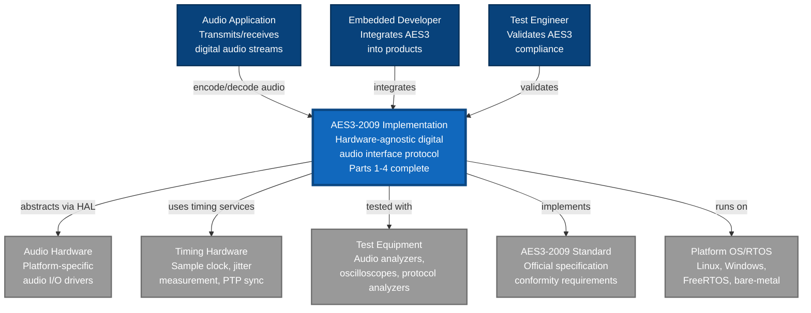

# C4 Model - Level 1: System Context

**Date**: 2025-11-05  
**Standard**: ISO/IEC/IEEE 42010:2011  
**Model**: C4 (Context, Containers, Components, Code)

---

## Purpose

Shows the AES3-2009 Digital Audio Interface system within its environment, identifying external actors and systems that interact with it.

## System Context Diagram

## Key Elements

### The System (Blue)

**AES3-2009 Implementation**
- **Purpose**: Hardware-agnostic reference implementation of AES3-2009 digital audio interface standard
- **Coverage**: All 4 parts (Audio Content, Metadata/Subcode, Transport, Physical/Electrical)
- **Key Feature**: Zero vendor-specific code in Standards layer
- **License**: Open-source (Apache-2.0 or equivalent)

### External Actors (Dark Blue)

1. **Audio Application**
   - Desktop/embedded audio software
   - Uses AES3 for professional audio I/O
   - Expects compliant PCM audio streams

2. **Embedded Developer**
   - Integrates AES3 into products
   - Implements <10 HAL functions
   - Targets: Consumer audio, pro audio, broadcast

3. **Test Engineer**
   - Validates AES3 conformity
   - Runs conformity test suite
   - Measures jitter, timing, signal quality

### External Systems (Gray)

1. **Audio Hardware**
   - Platform-specific audio I/O (ALSA, ASIO, CoreAudio, bare-metal)
   - Provides sample clock, bit transmission/reception
   - AES3 system abstracts via HAL interface

2. **Timing Hardware**
   - Sample clock generation (crystal oscillator, PLL)
   - Jitter measurement circuitry
   - Optional: PTP sync for multi-device systems

3. **Test Equipment**
   - Audio analyzers (Audio Precision, Prism Sound)
   - Oscilloscopes (jitter measurement)
   - Protocol analyzers (channel status decoding)

4. **AES3-2009 Standard**
   - Official specification (AES3-1/2/3/4-2009 R2014)
   - Defines conformity requirements
   - System must pass all conformity tests

5. **Platform OS/RTOS**
   - Linux (x86-64, ARM), Windows, FreeRTOS, bare-metal
   - Provides threading, memory management
   - System compiles/runs without modification

## Key Interfaces

| Interface | Type | Protocol | Description |
|-----------|------|----------|-------------|
| Application API | Software | C API | Encode/decode audio streams, configure parameters |
| HAL Interface | Software | C function pointers | <10 functions for platform adaptation |
| Audio Hardware | Hardware/Software | Platform-specific | Bit-level transmission/reception |
| Timing Hardware | Hardware | Clock signals | Sample clock, jitter measurement |

## Architectural Constraints

1. **Hardware Abstraction**: No vendor-specific code in Standards layer
2. **Standards Compliance**: 100% AES3-2009 Parts 1-4 coverage
3. **Platform Portability**: Compiles on Linux, Windows, RTOS, bare-metal
4. **Real-Time Performance**: <1 sample period latency (99th percentile)
5. **Open Source**: Permissive license for commercial use

## Quality Attributes

| Attribute | Target | Measurement |
|-----------|--------|-------------|
| **Conformity** | 100% AES3-2009 | Pass all conformity tests |
| **Portability** | 4+ platforms | Linux, Windows, RTOS, bare-metal |
| **Performance** | <20.8µs encoding @ 48kHz | 99th percentile latency |
| **Jitter** | <0.025 UI transmit | Per AES3-2009 Part 4 |
| **Integration Time** | <1 day | Developer survey |

## Stakeholder Mapping

| Stakeholder | Primary Concerns | Related Requirements |
|-------------|------------------|---------------------|
| Audio Equipment Manufacturers | Standards compliance, portability | StR-BUS-001, StR-FUNC-001-004 |
| Embedded Engineers | Simple integration, clear docs | StR-BUS-002, StR-FUNC-004 (HAL) |
| Test Engineers | Conformity validation, test suite | StR-QUAL-003 (conformity tests) |
| Academic Institutions | Educational value, code clarity | StR-BUS-003 (education) |
| Open-Source Community | License, contribution model | StR-BUS-001 (open-source) |

---

**Next Level**: [C4 Level 2 - Container View](c4-level2-container-view.md) - Shows high-level architecture with Standards layer, HAL layer, and platform bridges
