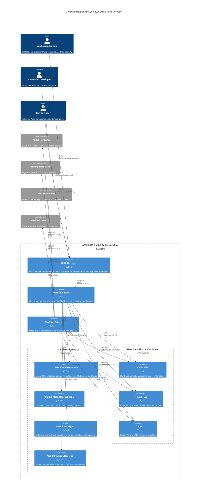

# C4 Level 2 - Container View: AES3-2009 Digital Audio Interface

## Overview

This document presents the C4 Level 2 Container View of the AES3-2009 Digital Audio Interface system, showing the internal high-level containers and their interactions. This view reveals the layered architecture with clear separation between standards implementation, hardware abstraction, and platform-specific code.

## Container Diagram



## Container Descriptions

### AES3 API Layer
**Technology**: C/C++  
**Purpose**: Provides the public interface for applications to use AES3 functionality  
**Responsibilities**:
- Application initialization and configuration
- High-level encode/decode operations
- Error handling and status reporting
- Resource management and cleanup
- Thread-safe operation coordination

**Key Interfaces**:
- `aes3_init()` - Initialize AES3 system
- `aes3_transmit()` - Transmit audio samples
- `aes3_receive()` - Receive audio samples  
- `aes3_configure()` - Set AES3 parameters
- `aes3_status()` - Query system status

### Standards Layer Containers

#### Part 1: Audio Content Container
**Technology**: C/C++  
**Purpose**: Implements AES3-2009 Part 1 audio content specification  
**Responsibilities**:
- Linear PCM encoding/decoding (16-24 bits)
- Sample rate support (32kHz, 44.1kHz, 48kHz and multiples)
- Word length justification to MSB
- Validity bit processing per sample
- Pre-emphasis indication (none, 50µs, J.17)
- DC content minimization

#### Part 2: Metadata/Subcode Container  
**Technology**: C/C++
**Purpose**: Implements AES3-2009 Part 2 metadata and subcode specification
**Responsibilities**:
- 192-bit channel status block management
- Channel status byte 0: basic audio parameters
- Channel status byte 1: channel modes, user bits
- Channel status byte 2: auxiliary bits, word length
- Channel status byte 23: CRCC validation (CRC-8)
- User data channel processing (1 bit per subframe)
- Alphanumeric channel origin/destination (ISO 646)

#### Part 3: Transport Container
**Technology**: C/C++
**Purpose**: Implements AES3-2009 Part 3 transport specification  
**Responsibilities**:
- Subframe structure (32 time slots, 2 UI each)
- Preambles X, Y, Z for synchronization (4 time slots)
- Biphase-mark channel coding (time slots 4-31) 
- Frame structure assembly (2 subframes per frame)
- Block structure coordination (192 frames per block)
- Even parity bit handling (time slot 31)
- Preamble detection and violation handling

#### Part 4: Physical/Electrical Container
**Technology**: C/C++
**Purpose**: Implements AES3-2009 Part 4 physical and electrical specification
**Responsibilities**:
- Jitter requirement definitions (<0.025 UI intrinsic)
- Balanced transmission specs (110Ω XLR-3)
- Coaxial transmission specs (75Ω BNC alternative)
- Signal amplitude requirements (2-7V p-p balanced)
- Rise/fall time specifications (0.03-0.18 UI)
- Receiver sensitivity specs (200mV min, 0.5 UI min)
- Cable length support (100m without equalization)

### Protocol Engine Container
**Technology**: C/C++
**Purpose**: Coordinates AES3 protocol state machines and real-time operations
**Responsibilities**:
- AES3 transmitter/receiver state machines
- Frame assembly and disassembly coordination  
- Real-time timing coordination
- Buffer management for continuous operation
- Error detection and recovery
- Performance monitoring and statistics

### Hardware Abstraction Layer (HAL) Containers

#### Audio HAL Container
**Technology**: C (hardware-agnostic)
**Purpose**: Abstracts audio hardware operations via minimal interface
**Responsibilities**:
- Audio sample input/output (≤10 functions per StR-BUS-002)
- Sample rate configuration
- Audio buffer management
- Interrupt/callback coordination
- Audio format conversion assistance

**Key Functions** (≤10 total):
```c
typedef struct {
    int (*init)(audio_config_t* config);
    int (*send_samples)(const int32_t* samples, size_t count);
    int (*receive_samples)(int32_t* buffer, size_t* count);  
    int (*set_sample_rate)(uint32_t sample_rate_hz);
    uint64_t (*get_sample_clock)(void);
    int (*set_callback)(audio_callback_t callback);
    int (*start)(void);
    int (*stop)(void);
    int (*get_status)(audio_status_t* status);
    void (*cleanup)(void);
} audio_hal_interface_t;
```

#### Timing HAL Container
**Technology**: C (hardware-agnostic)  
**Purpose**: Abstracts timing and clock hardware operations
**Responsibilities**:
- High-precision timestamp generation
- Clock synchronization support
- Timer interrupt management
- Jitter measurement assistance
- Clock source selection/configuration

#### I/O HAL Container  
**Technology**: C (hardware-agnostic)
**Purpose**: Abstracts digital I/O and GPIO operations
**Responsibilities**:
- Digital signal line control  
- GPIO configuration and control
- Interrupt handling for external signals
- Status LED control
- Test point access for validation

### Platform Bridge Container
**Technology**: C/C++
**Purpose**: Maps hardware-agnostic HAL to platform-specific implementations
**Responsibilities**:
- HAL function implementation for specific platforms
- Platform driver integration (ALSA, ASIO, DirectSound, etc.)
- OS service utilization (threads, timers, memory)
- Platform-specific optimization
- Hardware vendor driver integration

**Platform Support**:
- **Linux**: ALSA, PulseAudio, JACK integration
- **Windows**: ASIO, DirectSound, WASAPI integration  
- **RTOS**: FreeRTOS, ThreadX, VxWorks integration
- **Bare-metal**: Direct hardware register access

## Data Flow Architecture

### Transmit Path
1. **Audio Application** → **AES3 API Layer**: Raw audio samples
2. **AES3 API Layer** → **Protocol Engine**: Formatted audio with metadata
3. **Protocol Engine** → **Part 1 Container**: Sample encoding and formatting
4. **Protocol Engine** → **Part 2 Container**: Channel status and metadata  
5. **Protocol Engine** → **Part 3 Container**: Subframe/frame assembly
6. **Protocol Engine** → **Audio HAL**: AES3-encoded digital samples
7. **Audio HAL** → **Platform Bridge**: Hardware-agnostic audio data
8. **Platform Bridge** → **Audio Hardware**: Platform-specific audio output

### Receive Path  
1. **Audio Hardware** → **Platform Bridge**: Platform-specific audio input
2. **Platform Bridge** → **Audio HAL**: Hardware-agnostic audio data
3. **Audio HAL** → **Protocol Engine**: AES3-encoded digital samples
4. **Protocol Engine** → **Part 3 Container**: Subframe/frame disassembly
5. **Protocol Engine** → **Part 2 Container**: Channel status and metadata extraction
6. **Protocol Engine** → **Part 1 Container**: Sample decoding and formatting
7. **Protocol Engine** → **AES3 API Layer**: Decoded audio with metadata
8. **AES3 API Layer** → **Audio Application**: Raw audio samples

## Quality Attributes

### Performance
- **Latency**: <1 sample period (20.8µs @ 48kHz) - StR-PERF-001
- **Throughput**: Support up to 192kHz sample rates per AES5-2018
- **Jitter**: <0.025 UI intrinsic jitter per AES3-2009 Part 4
- **CPU Usage**: <5% on 100MHz ARM Cortex-M4 - StR-PERF-002

### Portability  
- **Hardware Abstraction**: ≤10 HAL functions per layer - StR-BUS-002
- **Platform Support**: Linux, Windows, RTOS, bare-metal - StR-PORT-001
- **Compiler Support**: GCC, Clang, MSVC, IAR, Keil - StR-PORT-002
- **Memory Footprint**: <64KB code, <16KB RAM - StR-PERF-003

### Reliability
- **Error Recovery**: Graceful degradation on signal loss - StR-REL-001  
- **Compliance**: 100% AES3-2009 specification coverage - StR-FUNC-001-004
- **Validation**: Comprehensive test coverage >95% - StR-VAL-001
- **Interoperability**: Cross-vendor compatibility testing - StR-INT-001

## Technology Decisions

### Programming Language: C/C++
- **Standards Layer**: Pure C for maximum portability and real-time determinism
- **API Layer**: C++ for object-oriented design and type safety  
- **HAL Layer**: Pure C for hardware abstraction consistency
- **Platform Bridge**: C/C++ matching platform conventions

### Memory Management
- **Static Allocation**: Preferred for real-time containers (Protocol Engine, Standards Layer)
- **Dynamic Allocation**: Allowed for API Layer initialization and configuration
- **Stack Usage**: Bounded and documented for RTOS compatibility
- **Buffer Management**: Circular buffers for continuous audio streaming

### Threading Model
- **Real-time Thread**: Protocol Engine and HAL operations
- **Application Thread**: API Layer and configuration operations
- **Interrupt Context**: Minimal processing, defer to threads
- **Synchronization**: Lock-free where possible, bounded priority inversion

## Container Dependencies

### Build Dependencies
```
AES3 API Layer
├── Protocol Engine
│   ├── Part 1: Audio Content
│   ├── Part 2: Metadata/Subcode  
│   ├── Part 3: Transport
│   └── Part 4: Physical/Electrical
├── Audio HAL
├── Timing HAL  
└── I/O HAL

Platform Bridge  
├── Audio HAL (implements)
├── Timing HAL (implements)
├── I/O HAL (implements)  
└── Platform OS/Drivers (uses)
```

### Runtime Dependencies
- **Protocol Engine** requires all HAL containers for hardware access
- **Standards Layer containers** are pure protocol logic (no external dependencies)
- **Platform Bridge** adapts between HAL interface and platform drivers
- **AES3 API Layer** orchestrates all containers for application interface

## Deployment Scenarios

### Embedded System Deployment
```
Application → AES3 API → Protocol Engine → HAL → Platform Bridge → Hardware
            (ARM M4)    (Real-time)      (C)   (RTOS/Bare)    (Registers)
```

### Desktop Application Deployment  
```
Application → AES3 API → Protocol Engine → HAL → Platform Bridge → Audio Driver
           (Windows)   (Thread)         (C)   (OS Services)    (ASIO/DirectSound)  
```

### Test Equipment Integration
```
Test App → AES3 API → Protocol Engine → HAL → Platform Bridge → Test Interface  
         (Linux)    (Process)        (C)   (User Space)     (Custom Protocol)
```

## Architectural Constraints

1. **Standards Compliance**: All containers must maintain 100% AES3-2009 specification compliance
2. **Hardware Abstraction**: HAL containers limited to ≤10 functions each for integration simplicity  
3. **Real-time Performance**: Protocol Engine must meet deterministic timing requirements
4. **Platform Portability**: Standards and HAL layers must compile without platform dependencies
5. **Memory Constraints**: Total footprint <64KB code + <16KB RAM for embedded deployment
6. **Thread Safety**: All public APIs must support concurrent access with bounded blocking
7. **Error Handling**: All containers must support graceful degradation and error recovery

## Related Views

- **[C4 Level 1 - System Context](c4-level1-system-context.md)**: Shows the system in its environment
- **[C4 Level 3 - Component View](c4-level3-component-view.md)** (Next): Detailed internal components within each container
- **[Architecture Decision Records](../decisions/)**: Key architectural decisions and rationale

## References

- **AES3-2009**: Digital audio interface standard (Parts 1-4)  
- **ISO/IEC/IEEE 42010:2011**: Architecture description standard
- **C4 Model**: Context, Containers, Components, Code modeling approach
- **StR-BUS-002**: Hardware abstraction requirements (≤10 HAL functions)
- **StR-FUNC-001-004**: AES3-2009 Parts 1-4 implementation requirements