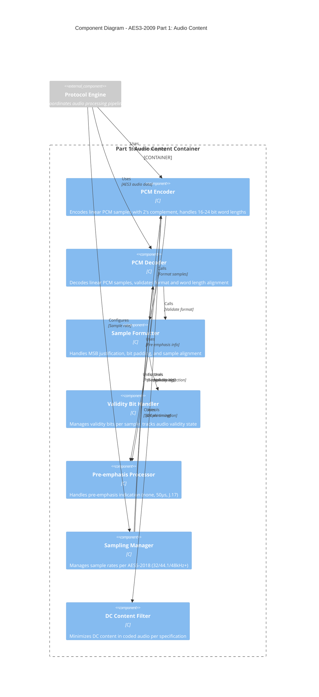
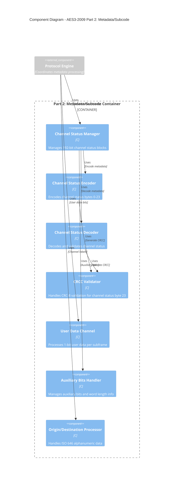
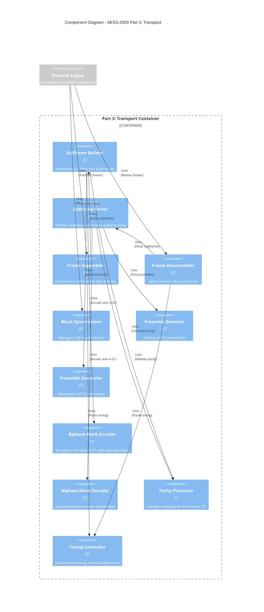
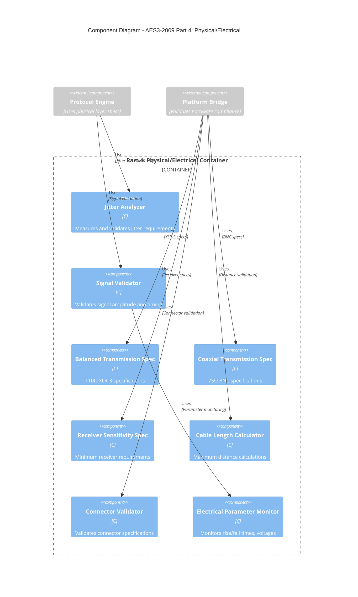

# C4 Level 3 - Component View: AES3-2009 Digital Audio Interface

## Overview

This document presents the C4 Level 3 Component View of the AES3-2009 Digital Audio Interface system, showing the detailed internal components within each container. This view focuses on the Standards Layer containers, revealing the specific components that implement each part of the AES3-2009 specification.

## Component Diagrams

### Part 1: Audio Content Components



### Part 2: Metadata/Subcode Components



### Part 3: Transport Components



### Part 4: Physical/Electrical Components



## Component Details

### Part 1: Audio Content Components

#### PCM Encoder Component
**Purpose**: Encodes linear PCM audio samples according to AES3-2009 Part 1  
**Key Functions**:
- `pcm_encode_sample()` - Encode 16-24 bit linear PCM
- `pcm_set_word_length()` - Configure word length (16, 20, 24 bits)
- `pcm_apply_2s_complement()` - Apply 2's complement coding
- `pcm_validate_range()` - Validate sample value ranges

**Interfaces**:
```c
typedef struct {
    int (*encode_sample)(int32_t sample, uint8_t word_length, uint32_t* encoded);
    int (*set_word_length)(uint8_t bits);
    int (*validate_sample)(int32_t sample, uint8_t word_length);
} pcm_encoder_interface_t;
```

#### Sample Formatter Component  
**Purpose**: Handles MSB justification and bit alignment per AES3-2009 Part 1
**Key Functions**:
- `format_msb_justify()` - Left-justify samples to MSB
- `format_pad_bits()` - Handle unused LSBs
- `format_align_word()` - Align to AES3 word boundaries
- `format_validate_alignment()` - Validate sample alignment

#### Validity Bit Handler Component
**Purpose**: Manages validity bits according to AES3-2009 Part 1 Clause 6
**Key Functions**:
- `validity_set_bit()` - Set validity bit per sample
- `validity_get_bit()` - Read validity bit status
- `validity_validate_audio()` - Validate audio data integrity
- `validity_handle_error()` - Handle invalid audio detection

### Part 2: Metadata/Subcode Components

#### Channel Status Manager Component
**Purpose**: Manages 192-bit channel status blocks per AES3-2009 Part 2
**Key Functions**:
- `cs_init_block()` - Initialize 192-bit block
- `cs_set_byte()` - Set specific channel status byte
- `cs_get_byte()` - Read channel status byte
- `cs_validate_block()` - Validate complete block

**Channel Status Block Structure**:
```c
typedef struct {
    uint8_t byte0;    // Basic audio parameters (emphasis, lock, sampling frequency)
    uint8_t byte1;    // Channel modes, user bits management  
    uint8_t byte2;    // Auxiliary bits, word length alignment
    uint8_t bytes3_22[20];  // Additional metadata
    uint8_t byte23;   // CRCC (CRC-8 validation)
} channel_status_block_t;
```

#### CRCC Validator Component
**Purpose**: Implements CRC-8 validation per AES3-2009 Part 2
**Key Functions**:
- `crcc_calculate()` - Calculate CRC-8 for bytes 0-22
- `crcc_validate()` - Validate received CRCC
- `crcc_get_polynomial()` - Get CRC-8 polynomial (x^8 + x^4 + x^3 + x^2 + 1)

### Part 3: Transport Components

#### Subframe Builder Component
**Purpose**: Assembles 32 time slot subframes per AES3-2009 Part 3
**Key Functions**:
- `subframe_init()` - Initialize subframe structure
- `subframe_add_preamble()` - Add X/Y/Z preamble (slots 0-3)
- `subframe_add_audio()` - Add audio data (slots 4-27)
- `subframe_add_validity()` - Add validity bit (slot 28)
- `subframe_add_user_data()` - Add user data (slot 29)
- `subframe_add_channel_status()` - Add channel status bit (slot 30)
- `subframe_add_parity()` - Add even parity (slot 31)

**Subframe Structure**:
```c
typedef struct {
    uint8_t preamble[4];      // Slots 0-3: Preamble (X/Y/Z)
    uint32_t audio_data;      // Slots 4-27: Audio sample (24 bits max)
    uint8_t validity_bit;     // Slot 28: Validity bit
    uint8_t user_data_bit;    // Slot 29: User data bit
    uint8_t channel_status_bit; // Slot 30: Channel status bit
    uint8_t parity_bit;       // Slot 31: Even parity bit
} aes3_subframe_t;
```

#### Biphase-Mark Encoder Component
**Purpose**: Implements biphase-mark coding per AES3-2009 Part 3
**Key Functions**:
- `biphase_encode_slot()` - Encode single time slot (2 UI)
- `biphase_encode_audio()` - Encode audio data slots 4-27
- `biphase_maintain_dc_balance()` - Maintain DC balance
- `biphase_generate_transitions()` - Generate proper transitions

#### Preamble Generator Component
**Purpose**: Generates synchronization preambles per AES3-2009 Part 3
**Key Functions**:
- `preamble_generate_x()` - Generate X preamble (first subframe)
- `preamble_generate_y()` - Generate Y preamble (second subframe)  
- `preamble_generate_z()` - Generate Z preamble (block start)
- `preamble_violate_biphase()` - Create biphase-mark violations for sync

**Preamble Patterns**:
```c
#define AES3_PREAMBLE_X 0xE2  // 11100010 (first subframe)
#define AES3_PREAMBLE_Y 0xE4  // 11100100 (second subframe)
#define AES3_PREAMBLE_Z 0xE8  // 11101000 (block start)
```

### Part 4: Physical/Electrical Components

#### Jitter Analyzer Component
**Purpose**: Validates jitter requirements per AES3-2009 Part 4
**Key Functions**:
- `jitter_measure_intrinsic()` - Measure intrinsic jitter (<0.025 UI)
- `jitter_analyze_pattern()` - Analyze jitter patterns
- `jitter_validate_limits()` - Validate against specification limits
- `jitter_generate_report()` - Generate jitter measurement report

#### Signal Validator Component  
**Purpose**: Validates electrical signal parameters per AES3-2009 Part 4
**Key Functions**:
- `signal_validate_amplitude()` - Check 2-7V peak-to-peak (balanced)
- `signal_validate_rise_fall()` - Check 0.03-0.18 UI rise/fall times
- `signal_check_receiver_sensitivity()` - Validate 200mV minimum
- `signal_measure_impedance()` - Measure 110Ω (XLR) or 75Ω (BNC)

## Component Interactions

### Transmit Data Flow
1. **PCM Encoder** receives raw audio samples
2. **Sample Formatter** applies MSB justification and padding
3. **Validity Handler** adds validity bits per sample
4. **Channel Status Manager** builds 192-bit metadata blocks
5. **Subframe Builder** assembles 32-slot subframes
6. **Biphase Encoder** applies channel coding to slots 4-31
7. **Preamble Generator** adds X/Y/Z synchronization
8. **Signal Validator** ensures electrical compliance

### Receive Data Flow
1. **Preamble Detector** identifies X/Y/Z synchronization
2. **Biphase Decoder** decodes slots 4-31 channel coding
3. **Subframe Parser** extracts 32-slot structure
4. **Frame Disassembler** separates subframes
5. **Channel Status Decoder** extracts 192-bit blocks
6. **CRCC Validator** validates metadata integrity
7. **PCM Decoder** recovers linear audio samples
8. **Validity Handler** checks audio data validity

## Performance Characteristics

### Part 1 Components
- **PCM Encoder/Decoder**: <100ns per sample @ 48kHz
- **Sample Formatter**: <50ns alignment operation
- **Validity Handler**: <10ns per validity bit

### Part 2 Components  
- **Channel Status Manager**: <1µs block assembly
- **CRCC Validator**: <500ns CRC-8 calculation
- **User Data Channel**: <5ns per bit

### Part 3 Components
- **Subframe Builder**: <2µs complete subframe
- **Biphase Encoder**: <50ns per time slot
- **Preamble Generator**: <200ns preamble creation

### Part 4 Components
- **Jitter Analyzer**: Real-time measurement
- **Signal Validator**: <1ms parameter check

## Memory Requirements

### Static Memory (Per Component)
- **PCM Components**: 2KB code + 256B data
- **Channel Status Components**: 1.5KB code + 192B data  
- **Transport Components**: 4KB code + 512B data
- **Physical Layer Components**: 1KB code + 128B data

### Total Part Memory Footprint
- **Part 1**: ~8KB code + 1KB RAM
- **Part 2**: ~6KB code + 768B RAM
- **Part 3**: ~16KB code + 2KB RAM  
- **Part 4**: ~4KB code + 512B RAM
- **Total Standards Layer**: ~34KB code + 4.3KB RAM

## Error Handling

### Component-Level Error Handling
All components implement consistent error handling:

```c
typedef enum {
    AES3_SUCCESS = 0,
    AES3_ERROR_INVALID_PARAMETER,
    AES3_ERROR_BUFFER_OVERFLOW,
    AES3_ERROR_INVALID_FORMAT,
    AES3_ERROR_TIMING_VIOLATION,
    AES3_ERROR_COMPLIANCE_FAILURE
} aes3_result_t;
```

### Graceful Degradation
- **Audio Quality**: Maintain best possible quality on errors
- **Metadata Loss**: Continue audio with metadata indication
- **Timing Issues**: Resynchronize without audio dropout
- **Physical Layer**: Adapt to signal conditions

## Testing Strategy

### Component Unit Tests
- **Part 1**: Audio encoding/decoding accuracy tests
- **Part 2**: Metadata integrity and CRCC validation tests  
- **Part 3**: Transport protocol compliance tests
- **Part 4**: Physical parameter validation tests

### Integration Tests
- **Cross-Part Integration**: End-to-end audio path testing
- **Real-time Performance**: Timing and latency validation
- **Error Recovery**: Fault injection and recovery testing
- **Compliance Testing**: AES3-2009 specification validation

## Related Views

- **[C4 Level 2 - Container View](c4-level2-container-view.md)**: Shows the containers that contain these components
- **[C4 Level 1 - System Context](c4-level1-system-context.md)**: Shows the system in its environment  
- **[Architecture Decision Records](../decisions/)**: Key architectural decisions affecting components

## References

- **AES3-2009 Part 1**: Audio content specification
- **AES3-2009 Part 2**: Metadata and subcode specification  
- **AES3-2009 Part 3**: Transport specification
- **AES3-2009 Part 4**: Physical and electrical specification
- **AES5-2018**: Preferred sampling frequencies for audio systems
- **ISO 646**: 7-bit coded character set for alphanumeric data