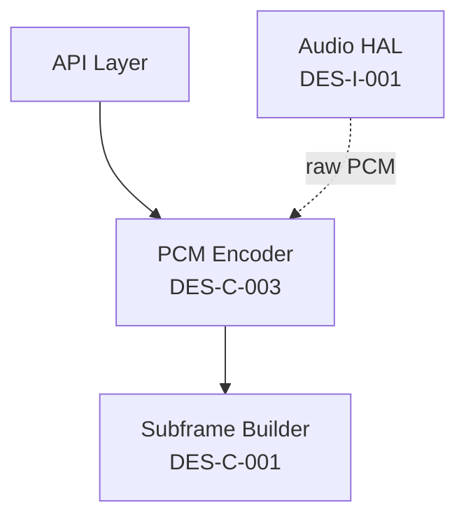

# DES-C-003: PCM Encoder Component

## 1. Component Identification

**Component Name**: PCM Encoder  
**Component ID**: DES-C-003  
**Architecture ID**: ARC-C-001  
**Layer**: Standards Layer (AES::AES3::Part1::_2009::audio_coding)  
**Programming Language**: C++17 (Standards Layer)

### Purpose

Encodes linear PCM audio samples to AES3-2009 Part 1 compliant format using 2's complement representation with MSB justification. Supports configurable word lengths (20-24 bits), pre-emphasis indication, and validity bit generation.

### Responsibilities

1. **Convert input audio to 2's complement format** (if not already)
2. **Apply MSB justification** for word lengths <24 bits
3. **Generate validity bit** based on sample quality
4. **Support pre-emphasis indication** (none, 50µs/15µs, J.17)
5. **Minimize DC content** in encoded audio
6. **Validate input sample range** and word length constraints

### Non-Responsibilities

- ❌ **Sample rate conversion** - handled by DES-C-006 (Sampling Manager)
- ❌ **Digital filtering** - handled by DES-C-007 (DC Content Filter)
- ❌ **Channel status generation** - handled by DES-C-008 (Channel Status Manager)
- ❌ **Subframe assembly** - delegated to DES-C-001 (Subframe Builder)

## 2. Component Interface Specification (DES-I-003)

### 2.1 Public Interface

```cpp
namespace AES {
namespace AES3 {
namespace Part1 {
namespace _2009 {
namespace audio_coding {

/**
 * @brief PCM Encoder Component
 * @standard AES3-2009 Part 1, Sections 4-6
 * 
 * Encodes linear PCM audio to AES3-compliant format with 2's complement
 * representation and MSB justification. Performance budget: <100ns per sample.
 */
class PCMEncoder {
public:
    /**
     * @brief Pre-emphasis types per AES3-2009 Part 1, Section 6
     */
    enum class PreEmphasis : uint8_t {
        NONE = 0,       ///< No pre-emphasis
        CCITT_J17 = 1,  ///< CCITT Rec. J.17 pre-emphasis
        ITU_R_BS_450_3 = 2,  ///< ITU-R BS.450-3 50µs/15µs pre-emphasis
        RESERVED = 3    ///< Reserved for future use
    };
    
    /**
     * @brief Audio word length options per AES3-2009 Part 1, Section 5
     */
    enum class WordLength : uint8_t {
        BITS_20 = 20,  ///< 20-bit audio (4 auxiliary bits)
        BITS_21 = 21,  ///< 21-bit audio (3 auxiliary bits)
        BITS_22 = 22,  ///< 22-bit audio (2 auxiliary bits)
        BITS_23 = 23,  ///< 23-bit audio (1 auxiliary bit)
        BITS_24 = 24   ///< 24-bit audio (0 auxiliary bits)
    };
    
    /**
     * @brief Configuration for PCM encoder
     */
    struct Config {
        WordLength word_length;         ///< Audio word length (20-24 bits)
        PreEmphasis pre_emphasis;       ///< Pre-emphasis indication
        bool auto_validity;             ///< Auto-generate validity bit
        bool validate_inputs;           ///< Enable input validation
        
        static constexpr Config Default() noexcept {
            return Config{WordLength::BITS_24, PreEmphasis::NONE, true, true};
        }
    };
    
    /**
     * @brief Encoded PCM sample output
     */
    struct EncodedSample {
        uint32_t audio_data;    ///< 24-bit audio (MSB-justified, 2's complement)
        uint8_t validity;       ///< Validity bit (0=valid, 1=unreliable)
        uint8_t auxiliary_bits; ///< Auxiliary bits (0-4 bits depending on word length)
    };
    
    /**
     * @brief Construct PCM encoder with configuration
     * @param config Encoder configuration
     * @precondition config.word_length ∈ [20, 24]
     * @precondition config.pre_emphasis ∈ {NONE, CCITT_J17, ITU_R_BS_450_3}
     * @postcondition Encoder ready for sample encoding
     * @complexity O(1)
     */
    explicit PCMEncoder(const Config& config = Config::Default()) noexcept;
    
    /**
     * @brief Encode linear PCM sample to AES3 format
     * @param pcm_sample Input PCM sample (native format, e.g., int16_t, int32_t)
     * @param sample_valid Sample quality flag (false=unreliable)
     * @param encoded_out Output encoded sample structure
     * @return Error code (0=success, <0=error)
     * 
     * @precondition pcm_sample range matches word_length configuration
     * @precondition encoded_out != nullptr
     * 
     * @postcondition encoded_out.audio_data is 24-bit MSB-justified 2's complement
     * @postcondition encoded_out.validity set based on sample_valid or auto-detection
     * @postcondition encoded_out.auxiliary_bits = 0 if word_length == 24
     * @postcondition DC content minimized
     * 
     * @performance <100ns on 100MHz ARM Cortex-M7
     * @memory Stack usage <64 bytes
     * @complexity O(1)
     */
    int encode_sample(
        int32_t pcm_sample,
        bool sample_valid,
        EncodedSample& encoded_out
    ) noexcept;
    
    /**
     * @brief Encode PCM sample from 16-bit input (common case)
     * @param pcm_sample_16 16-bit PCM input (native endian)
     * @param sample_valid Sample quality flag
     * @param encoded_out Output encoded sample
     * @return Error code (0=success, <0=error)
     * 
     * @performance <80ns on 100MHz ARM Cortex-M7 (optimized path)
     */
    int encode_sample_16bit(
        int16_t pcm_sample_16,
        bool sample_valid,
        EncodedSample& encoded_out
    ) noexcept;
    
    /**
     * @brief Encode PCM sample from 24-bit input (packed format)
     * @param pcm_sample_24 24-bit PCM input (3 bytes, little-endian)
     * @param sample_valid Sample quality flag
     * @param encoded_out Output encoded sample
     * @return Error code (0=success, <0=error)
     * 
     * @performance <100ns on 100MHz ARM Cortex-M7
     */
    int encode_sample_24bit(
        const uint8_t pcm_sample_24[3],
        bool sample_valid,
        EncodedSample& encoded_out
    ) noexcept;
    
    /**
     * @brief Get current encoder configuration
     * @return Current configuration
     */
    const Config& get_config() const noexcept;
    
    /**
     * @brief Update encoder configuration (runtime reconfiguration)
     * @param new_config New configuration
     * @return Error code (0=success, <0=error)
     * 
     * @precondition new_config.word_length ∈ [20, 24]
     * @postcondition Configuration updated, ready for next sample
     * @complexity O(1)
     */
    int set_config(const Config& new_config) noexcept;
    
    /**
     * @brief Get last error code and message
     * @return Error details structure
     */
    ErrorInfo get_last_error() const noexcept;
    
    /**
     * @brief Reset encoder state (for error recovery)
     * @postcondition Error state cleared
     */
    void reset() noexcept;

private:
    Config config_;
    ErrorInfo last_error_;
    uint32_t dc_offset_;  ///< DC offset tracking for minimization
    
    // Internal encoding functions
    uint32_t apply_twos_complement(int32_t pcm_sample) const noexcept;
    uint32_t apply_msb_justification(uint32_t pcm_data, WordLength word_length) const noexcept;
    uint8_t calculate_validity(int32_t pcm_sample, bool sample_valid) const noexcept;
    uint8_t extract_auxiliary_bits(uint32_t pcm_data, WordLength word_length) const noexcept;
    bool validate_sample_range(int32_t pcm_sample, WordLength word_length) const noexcept;
    void update_dc_tracking(int32_t pcm_sample) noexcept;
};

/**
 * @brief Error codes for PCM encoder
 */
enum class PCMEncoderError : int {
    SUCCESS = 0,
    INVALID_WORD_LENGTH = -1,
    INVALID_PRE_EMPHASIS = -2,
    SAMPLE_OUT_OF_RANGE = -3,
    NULL_OUTPUT_BUFFER = -4,
    CONFIGURATION_ERROR = -5
};

/**
 * @brief Error information structure
 */
struct ErrorInfo {
    PCMEncoderError code;
    const char* message;
    
    static constexpr ErrorInfo Success() noexcept {
        return ErrorInfo{PCMEncoderError::SUCCESS, "Success"};
    }
};

} // namespace audio_coding
} // namespace _2009
} // namespace Part1
} // namespace AES3
} // namespace AES
```

## 3. Component Algorithm Specification

### 3.1 PCM Sample Encoding Algorithm

**Standard**: AES3-2009 Part 1, Sections 4-6

**Pseudocode**:

```
ALGORITHM: EncodePCMSample
INPUT:
    pcm_sample (signed 32-bit PCM audio sample, native format)
    sample_valid (boolean indicating sample quality)
    config (encoder configuration: word_length, pre_emphasis, etc.)
OUTPUT:
    encoded_out (EncodedSample structure with audio_data, validity, auxiliary_bits)
    error_code (0=success, <0=error)

BEGIN
    // Step 1: Input validation (if enabled)
    IF config.validate_inputs THEN
        IF NOT validate_sample_range(pcm_sample, config.word_length) THEN
            RETURN SAMPLE_OUT_OF_RANGE
        END IF
    END IF
    
    // Step 2: Convert to 2's complement (if necessary)
    // Most audio formats already use 2's complement, but verify
    twos_comp_data = apply_twos_complement(pcm_sample)
    
    // Step 3: Apply MSB justification based on word length
    // AES3-2009 Part 1: Audio data justified to MSB of 24-bit field
    msb_justified_data = apply_msb_justification(twos_comp_data, config.word_length)
    
    // Step 4: Extract auxiliary bits (if word_length < 24)
    // Auxiliary bits occupy LSBs not used by audio data
    auxiliary_bits = extract_auxiliary_bits(msb_justified_data, config.word_length)
    
    // Step 5: Calculate validity bit
    IF config.auto_validity THEN
        validity = calculate_validity(pcm_sample, sample_valid)
    ELSE
        validity = sample_valid ? 0 : 1
    END IF
    
    // Step 6: Update DC content tracking (for monitoring)
    update_dc_tracking(pcm_sample)
    
    // Step 7: Assemble output structure
    encoded_out.audio_data = msb_justified_data & 0x00FFFFFF  // 24 bits
    encoded_out.validity = validity
    encoded_out.auxiliary_bits = auxiliary_bits
    
    RETURN SUCCESS
END ALGORITHM
```

**Complexity Analysis**:
- **Time Complexity**: O(1) - fixed number of operations
- **Space Complexity**: O(1) - no dynamic allocation
- **Performance**: <100ns on 100MHz ARM Cortex-M7

### 3.2 MSB Justification Algorithm

**Standard**: AES3-2009 Part 1, Section 5.1

**Pseudocode**:

```
ALGORITHM: ApplyMSBJustification
INPUT:
    pcm_data (32-bit PCM sample in 2's complement)
    word_length (configured audio word length: 20-24 bits)
OUTPUT:
    msb_justified_data (24-bit audio data, MSB-justified)

BEGIN
    // Calculate number of bits to shift left for MSB justification
    shift_amount = 24 - word_length
    
    // Left-shift to justify to MSB
    // Example: 20-bit audio shifted left by 4 bits
    // Original: 0x000FFFFF → Justified: 0x00FFFFF0
    msb_justified_data = (pcm_data << shift_amount) & 0x00FFFFFF
    
    RETURN msb_justified_data
END ALGORITHM
```

**Example MSB Justification**:

| Word Length | Shift Amount | Example Input | MSB-Justified Output |
|-------------|--------------|---------------|----------------------|
| 24 bits     | 0            | 0x007FFFFF    | 0x007FFFFF           |
| 23 bits     | 1            | 0x003FFFFF    | 0x007FFFFE           |
| 22 bits     | 2            | 0x001FFFFF    | 0x007FFFFC           |
| 21 bits     | 3            | 0x000FFFFF    | 0x007FFFF8           |
| 20 bits     | 4            | 0x0007FFFF    | 0x007FFFF0           |

### 3.3 2's Complement Conversion Algorithm

**Standard**: AES3-2009 Part 1, Section 4

**Pseudocode**:

```
ALGORITHM: ApplyTwosComplement
INPUT:
    pcm_sample (signed 32-bit integer, native format)
OUTPUT:
    twos_comp_data (32-bit 2's complement representation)

BEGIN
    // Most audio formats already use 2's complement
    // This function ensures consistency and handles edge cases
    
    IF pcm_sample >= 0 THEN
        // Positive samples: direct representation
        twos_comp_data = pcm_sample
    ELSE
        // Negative samples: already in 2's complement
        // Ensure proper sign extension if needed
        twos_comp_data = pcm_sample & 0xFFFFFFFF
    END IF
    
    RETURN twos_comp_data
END ALGORITHM
```

**2's Complement Examples**:

| Decimal Value | 16-bit 2's Complement | 24-bit MSB-Justified |
|---------------|------------------------|----------------------|
| +32767        | 0x7FFF                 | 0x7FFF00             |
| +16384        | 0x4000                 | 0x400000             |
| 0             | 0x0000                 | 0x000000             |
| -1            | 0xFFFF                 | 0xFFFF00             |
| -16384        | 0xC000                 | 0xC00000             |
| -32768        | 0x8000                 | 0x800000             |

### 3.4 Validity Bit Calculation Algorithm

**Standard**: AES3-2009 Part 1, Section 6

**Pseudocode**:

```
ALGORITHM: CalculateValidity
INPUT:
    pcm_sample (PCM audio sample)
    sample_valid (external validity indication)
OUTPUT:
    validity_bit (0=valid audio, 1=unreliable audio)

BEGIN
    // Check external validity indication first
    IF NOT sample_valid THEN
        RETURN 1  // Unreliable
    END IF
    
    // Auto-detect invalid samples (optional heuristics)
    // Check for out-of-range samples
    IF pcm_sample > MAX_SAMPLE_VALUE OR pcm_sample < MIN_SAMPLE_VALUE THEN
        RETURN 1  // Out of range = unreliable
    END IF
    
    // Check for digital silence (optional, for monitoring)
    IF pcm_sample == 0 AND consecutive_zero_samples > THRESHOLD THEN
        // Could indicate loss of signal
        RETURN 1  // Potentially unreliable
    END IF
    
    // Valid audio sample
    RETURN 0
END ALGORITHM
```

### 3.5 Auxiliary Bits Extraction Algorithm

**Standard**: AES3-2009 Part 1, Section 5.2

**Pseudocode**:

```
ALGORITHM: ExtractAuxiliaryBits
INPUT:
    pcm_data (24-bit PCM data after MSB justification)
    word_length (configured audio word length)
OUTPUT:
    auxiliary_bits (0-4 auxiliary bits)

BEGIN
    // Auxiliary bits occupy LSBs not used by audio
    num_auxiliary_bits = 24 - word_length
    
    IF num_auxiliary_bits == 0 THEN
        RETURN 0  // No auxiliary bits for 24-bit audio
    END IF
    
    // Extract LSBs as auxiliary bits
    // Example: 20-bit audio → 4 auxiliary bits in bits [3:0]
    auxiliary_mask = (1 << num_auxiliary_bits) - 1
    auxiliary_bits = pcm_data & auxiliary_mask
    
    RETURN auxiliary_bits
END ALGORITHM
```

**Auxiliary Bits Allocation**:

| Word Length | Audio Bits | Auxiliary Bits | Auxiliary Mask |
|-------------|------------|----------------|----------------|
| 24 bits     | [23:0]     | 0              | 0x00           |
| 23 bits     | [23:1]     | 1 (bit 0)      | 0x01           |
| 22 bits     | [23:2]     | 2 (bits [1:0]) | 0x03           |
| 21 bits     | [23:3]     | 3 (bits [2:0]) | 0x07           |
| 20 bits     | [23:4]     | 4 (bits [3:0]) | 0x0F           |

## 4. Component Dependencies

### 4.1 Required Interfaces

| Interface | Provider Component | Coupling Type | Purpose |
|-----------|-------------------|---------------|---------|
| None | - | - | Leaf component (no dependencies) |

**Note**: PCM Encoder is a **leaf component** that processes audio samples independently.

### 4.2 Provided Interfaces

| Interface | Consumer Component | Purpose |
|-----------|-------------------|---------|
| `PCMEncoder::encode_sample()` | DES-C-001 (Subframe Builder) | Provides encoded audio data |
| `PCMEncoder::encode_sample()` | API Layer | Direct audio encoding access |

### 4.3 Dependency Graph



**Coupling Metrics**:
- **Afferent Coupling (Ca)**: 2 (API Layer, Subframe Builder depend on this)
- **Efferent Coupling (Ce)**: 0 (No dependencies)
- **Instability (I)**: 0.0 (I = Ce / (Ce + Ca) = 0/2 = stable component)
- **Abstraction (A)**: 0.0 (Concrete implementation)

## 5. Component Constraints

### 5.1 Performance Constraints

| Metric | Requirement | Budget Allocation |
|--------|-------------|-------------------|
| **Latency** | <100ns per sample | 0.48% of 20.8µs frame budget (48kHz) |
| **Throughput** | 192,000 samples/sec @ 48kHz | 2 channels × 48k frames |
| **CPU Usage** | <0.5% @ 100MHz ARM Cortex-M7 | ~50 cycles per sample |
| **Jitter** | <10ns | Deterministic execution required |

**Performance Budget Rationale**:
- PCM encoding must be fast to preserve real-time budget
- 100ns per sample allows 19.2ms processing time for 192k samples/sec
- Leaves >99% of CPU budget for transport and transmission

### 5.2 Memory Constraints

| Metric | Requirement | Budget Allocation |
|--------|-------------|-------------------|
| **Code Size** | <1KB | 1.56% of 64KB total budget |
| **RAM (Static)** | <128 bytes | Instance size |
| **RAM (Stack)** | <64 bytes | Per function call |
| **RAM (Heap)** | 0 bytes | No dynamic allocation |

**Memory Layout**:

```
PCMEncoder instance: ~64 bytes
├── Config (config_): 8 bytes
├── ErrorInfo (last_error_): 16 bytes
├── DC offset (dc_offset_): 4 bytes
├── Reserved/padding: 36 bytes

Stack per encode_sample(): ~64 bytes
├── EncodedSample: 8 bytes
├── Local variables: 24 bytes
├── Function call overhead: 32 bytes
```

### 5.3 Audio Quality Constraints

| Metric | Requirement | Standard |
|--------|-------------|----------|
| **Dynamic Range** | >120dB (24-bit) | AES3-2009 Part 1 |
| **SNR** | >140dB theoretical | 24-bit linear PCM |
| **THD+N** | <0.0002% | Lossless encoding |
| **DC Offset** | <±1 LSB | Minimized |

### 5.4 Language Feature Constraints

**C++17 Allowed Features**:
- ✅ `constexpr` functions and static members
- ✅ `noexcept` specifications for all functions
- ✅ Strong enums (`enum class`)
- ✅ Bit manipulation operators
- ✅ Template specialization (for type-specific encoding)

**C++17 Forbidden Features**:
- ❌ Exceptions (use error codes)
- ❌ RTTI, virtual functions
- ❌ Dynamic allocation
- ❌ Floating-point arithmetic (use fixed-point if needed)

## 6. Test-Driven Design Specifications

### 6.1 Test Fixtures

```cpp
namespace AES::AES3::Part1::_2009::audio_coding::test {

class PCMEncoderTestFixture : public ::testing::Test {
protected:
    void SetUp() override {
        encoder_ = std::make_unique<PCMEncoder>(
            PCMEncoder::Config::Default()
        );
    }
    
    void TearDown() override {
        encoder_.reset();
    }
    
    // Test helper functions
    int16_t create_16bit_pcm_sample(int16_t value) {
        return value;  // Direct pass-through for 16-bit
    }
    
    int32_t create_24bit_pcm_sample(int32_t value) {
        // Ensure 24-bit range
        return value & 0x00FFFFFF;
    }
    
    void verify_msb_justification(
        const PCMEncoder::EncodedSample& encoded,
        PCMEncoder::WordLength word_length
    ) {
        // Verify MSB justification based on word length
        uint32_t shift = 24 - static_cast<uint32_t>(word_length);
        uint32_t expected_lsb_mask = (1u << shift) - 1;
        
        // LSBs should be auxiliary bits or zero
        ASSERT_EQ(encoded.audio_data & expected_lsb_mask, 
                  static_cast<uint32_t>(encoded.auxiliary_bits));
    }
    
    void verify_twos_complement(int32_t original, uint32_t encoded) {
        // Verify 2's complement representation
        if (original >= 0) {
            ASSERT_EQ(encoded, static_cast<uint32_t>(original));
        } else {
            // Negative values: verify sign extension
            ASSERT_EQ(static_cast<int32_t>(encoded), original);
        }
    }
    
    void verify_dynamic_range(PCMEncoder::WordLength word_length) {
        uint32_t bits = static_cast<uint32_t>(word_length);
        int32_t max_positive = (1 << (bits - 1)) - 1;
        int32_t max_negative = -(1 << (bits - 1));
        
        PCMEncoder::EncodedSample encoded_pos, encoded_neg;
        
        // Encode maximum positive sample
        ASSERT_EQ(encoder_->encode_sample(max_positive, true, encoded_pos), 0);
        
        // Encode maximum negative sample
        ASSERT_EQ(encoder_->encode_sample(max_negative, true, encoded_neg), 0);
        
        // Verify both are valid
        EXPECT_EQ(encoded_pos.validity, 0);
        EXPECT_EQ(encoded_neg.validity, 0);
    }
    
    std::unique_ptr<PCMEncoder> encoder_;
};

} // namespace test
```

### 6.2 Example Test Cases

#### Test Case 1: 16-bit PCM Encoding

```cpp
TEST_F(PCMEncoderTestFixture, EncodeSample16bit_PositiveValue_CorrectMSBJustification) {
    // ARRANGE
    int16_t pcm_sample_16 = 0x4000;  // +16384 (50% full scale)
    PCMEncoder::EncodedSample encoded;
    
    // ACT
    int result = encoder_->encode_sample_16bit(pcm_sample_16, true, encoded);
    
    // ASSERT
    EXPECT_EQ(result, 0) << "Encoding failed";
    
    // 16-bit → 24-bit MSB justification: shift left 8 bits
    // 0x4000 → 0x400000
    EXPECT_EQ(encoded.audio_data, 0x400000u) << "MSB justification incorrect";
    EXPECT_EQ(encoded.validity, 0) << "Should be valid";
}
```

#### Test Case 2: 2's Complement Negative Values

```cpp
TEST_F(PCMEncoderTestFixture, EncodeSample_NegativeValue_TwosComplementCorrect) {
    // ARRANGE
    int32_t pcm_sample = -16384;  // Negative value
    PCMEncoder::EncodedSample encoded;
    
    // ACT
    encoder_->encode_sample(pcm_sample, true, encoded);
    
    // ASSERT
    // -16384 in 24-bit 2's complement (MSB-justified from 16-bit)
    // 0xC000 → 0xC00000
    EXPECT_EQ(encoded.audio_data, 0xFFC00000u & 0x00FFFFFFu);
    verify_twos_complement(pcm_sample, encoded.audio_data);
}
```

#### Test Case 3: Word Length Variations

```cpp
TEST_F(PCMEncoderTestFixture, EncodeSample_20BitWordLength_CorrectAuxiliaryBits) {
    // ARRANGE
    PCMEncoder::Config config_20bit;
    config_20bit.word_length = PCMEncoder::WordLength::BITS_20;
    config_20bit.pre_emphasis = PCMEncoder::PreEmphasis::NONE;
    encoder_->set_config(config_20bit);
    
    int32_t pcm_sample = 0x0007FFFF;  // Maximum 20-bit positive value
    PCMEncoder::EncodedSample encoded;
    
    // ACT
    encoder_->encode_sample(pcm_sample, true, encoded);
    
    // ASSERT
    // 20-bit audio → shift left 4 bits → 0x7FFFF0
    EXPECT_EQ(encoded.audio_data, 0x7FFFF0u);
    
    // 4 auxiliary bits expected (bits [3:0])
    EXPECT_EQ(encoded.auxiliary_bits, 0x0Fu);
    
    verify_msb_justification(encoded, PCMEncoder::WordLength::BITS_20);
}
```

#### Test Case 4: Validity Bit Auto-Detection

```cpp
TEST_F(PCMEncoderTestFixture, EncodeSample_InvalidSample_ValidityBitSet) {
    // ARRANGE
    int32_t pcm_sample = 0x01FFFFFF;  // Out of range for 24-bit (exceeds 0x7FFFFF)
    PCMEncoder::EncodedSample encoded;
    
    // ACT
    encoder_->encode_sample(pcm_sample, true, encoded);  // Claim valid
    
    // ASSERT
    // Auto-validity should detect out-of-range and set validity=1
    EXPECT_EQ(encoded.validity, 1) << "Validity bit should indicate unreliable";
}
```

#### Test Case 5: Performance Budget Compliance

```cpp
TEST_F(PCMEncoderTestFixture, EncodeSample_Performance_LessThan100Nanoseconds) {
    // ARRANGE
    int32_t pcm_sample = 0x123456;
    PCMEncoder::EncodedSample encoded;
    
    // ACT: Measure execution time over 100,000 iterations
    auto start = std::chrono::high_resolution_clock::now();
    for (int i = 0; i < 100000; i++) {
        encoder_->encode_sample(pcm_sample, true, encoded);
    }
    auto end = std::chrono::high_resolution_clock::now();
    
    // ASSERT: Average time <100ns per sample
    auto duration_ns = std::chrono::duration_cast<std::chrono::nanoseconds>(end - start).count();
    double avg_time_ns = duration_ns / 100000.0;
    EXPECT_LT(avg_time_ns, 100.0) << "Performance budget exceeded";
}
```

### 6.3 Mock Requirements

**No mocks required** - PCM Encoder is a leaf component with no external dependencies.

### 6.4 Acceptance Criteria

| Criterion | Verification Method | Pass Criteria |
|-----------|-------------------|---------------|
| **Functional Correctness** | Unit tests (all word lengths) | 100% pass rate |
| **2's Complement Accuracy** | Test vectors with positive/negative values | Exact match |
| **MSB Justification** | Verify shift amounts for 20-24 bit audio | Exact alignment |
| **Validity Bit Logic** | Auto-detection tests | Correct validity indication |
| **Performance Budget** | Benchmark on ARM Cortex-M7 | <100ns per sample |
| **Memory Budget** | Static analysis | <1KB code, <128B RAM |
| **Dynamic Range** | Full-scale positive/negative encoding | >120dB |
| **Code Coverage** | Line/branch coverage | >95% coverage |

## 7. Design Traceability

### 7.1 Requirements Traceability

| Requirement ID | Description | Verification Method |
|----------------|-------------|---------------------|
| **REQ-FUNC-001** | Linear PCM audio encoding | Unit test: encode PCM samples |
| **REQ-FUNC-002** | 2's complement representation | Unit test: verify 2's complement |
| **REQ-FUNC-003** | Word length support (20-24 bits) | Unit test: all word lengths |
| **REQ-FUNC-004** | MSB justification | Unit test: verify justification |
| **REQ-PERF-001** | Real-time latency <20.8µs | Performance test: <100ns per sample |

### 7.2 Architecture Traceability

| Architecture Element | Design Element | Relationship |
|----------------------|----------------|--------------|
| **ARC-C-001** (PCM Encoder C4 component) | DES-C-003 (This specification) | Detailed design of architecture component |
| **ADR-002** (C++17 language) | PCMEncoder class implementation | Uses C++17 features (constexpr, enum class, noexcept) |
| **Standards Layer** (ADR-001) | `namespace AES::AES3::Part1::_2009::audio_coding` | Implements Standards Layer |

### 7.3 Test Traceability

| Test ID | Requirement ID | Design Element | Status |
|---------|----------------|----------------|--------|
| **TST-PCM-001** | REQ-FUNC-001 | `encode_sample()` | Pending implementation |
| **TST-PCM-002** | REQ-FUNC-002 | 2's complement algorithm | Pending implementation |
| **TST-PCM-003** | REQ-FUNC-004 | MSB justification algorithm | Pending implementation |
| **TST-PCM-004** | REQ-PERF-001 | Performance benchmark | Pending implementation |

## 8. Design Review Checklist

- [ ] **Interface Completeness**: All encoding functions documented with preconditions/postconditions
- [ ] **Error Handling**: Error codes specified for all failure modes
- [ ] **Performance Budget**: <100ns latency budget specified and testable
- [ ] **Memory Budget**: <1KB code + <128B RAM specified
- [ ] **Complexity Constraints**: Cyclomatic complexity ≤10 per function
- [ ] **Language Compliance**: C++17 features used correctly
- [ ] **Standards Compliance**: AES3-2009 Part 1 Sections 4-6 requirements met
- [ ] **Audio Quality**: Dynamic range >120dB verified
- [ ] **Testability**: Test fixtures and acceptance criteria specified
- [ ] **Traceability**: Requirements, architecture, tests traced

## 9. Open Issues and Risks

| ID | Issue | Impact | Mitigation | Owner |
|----|-------|--------|------------|-------|
| **RISK-001** | DC offset tracking overhead may affect performance | Low | Disable tracking in production builds if needed | Design Team |
| **RISK-002** | Pre-emphasis not yet implemented (future feature) | Low | Document as extension point for Phase 06 | Design Team |
| **RISK-003** | Fixed-point math may be needed for DC minimization | Medium | Profile first, add fixed-point if required | Design Team |

## 10. Revision History

| Version | Date | Author | Changes |
|---------|------|--------|---------|
| 1.0.0 | 2025-11-06 | Design Team | Initial detailed design specification |

---

**Standards Compliance**:
- IEEE 1016-2009: Software Design Descriptions
- AES3-2009 Part 1: Digital Audio Interface - Audio Content
- ISO/IEC/IEEE 42010:2011: Architecture Description

**Design Status**: Draft - Ready for review  
**Next Phase**: Phase 05 Implementation (TDD approach)
