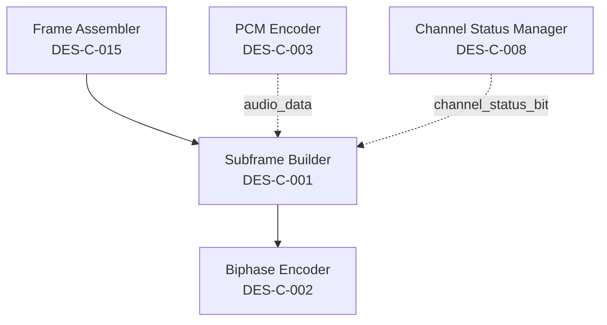

# DES-C-001: Subframe Builder Component

## 1. Component Identification

**Component Name**: Subframe Builder  
**Component ID**: DES-C-001  
**Architecture ID**: ARC-C-015  
**Layer**: Standards Layer (AES::AES3::Part3::_2009::subframe)  
**Programming Language**: C++17 (Standards Layer)

### Purpose

Constructs compliant AES3-2009 subframes according to Part 3 specification Section 4.1. Assembles 32 time slots containing preamble, audio data, auxiliary bits, validity bit, user bit, channel status bit, and parity bit into biphase-mark encoded format.

### Responsibilities

1. **Assemble 32 time slot subframe structure** from input components
2. **Insert appropriate preamble** (X/Y/Z) based on subframe position
3. **Calculate and insert even parity bit** in time slot 31
4. **Validate input data constraints** (word length, sample rate)
5. **Provide subframe data for biphase-mark encoding**

### Non-Responsibilities

- ❌ **Biphase-mark encoding** - delegated to DES-C-002 (Biphase Encoder)
- ❌ **Audio sample PCM encoding** - delegated to DES-C-003 (PCM Encoder)
- ❌ **Channel status bit selection** - receives from DES-C-008 (Channel Status Manager)
- ❌ **Frame assembly** (2 subframes) - delegated to DES-C-015 (Frame Assembler)

## 2. Component Interface Specification (DES-I-002)

### 2.1 Public Interface

```cpp
namespace AES {
namespace AES3 {
namespace Part3 {
namespace _2009 {
namespace subframe {

/**
 * @brief Subframe Builder Component
 * @standard AES3-2009 Part 3, Section 4.1
 * 
 * Constructs 32 time slot AES3 subframe structure compliant with
 * AES3-2009 specification. Performance budget: <5µs per subframe.
 */
class SubframeBuilder {
public:
    /**
     * @brief Construction parameters for subframe builder
     */
    struct Config {
        uint8_t max_audio_bits;        ///< Maximum audio word length (20-24 bits)
        uint8_t auxiliary_bits;        ///< Auxiliary bit usage (0-4 bits)
        bool validate_inputs;          ///< Enable input validation (disable for performance)
        
        static constexpr Config Default() noexcept {
            return Config{24, 0, true};  // 24-bit audio, no aux, validation on
        }
    };
    
    /**
     * @brief Construct subframe builder with configuration
     * @param config Builder configuration
     * @precondition config.max_audio_bits ∈ [20, 24]
     * @precondition config.auxiliary_bits ∈ [0, 4]
     * @postcondition Builder ready for subframe assembly
     * @complexity O(1)
     */
    explicit SubframeBuilder(const Config& config = Config::Default()) noexcept;
    
    /**
     * @brief Build subframe from input components
     * @param audio_data 24-bit audio sample (MSB-justified, 2's complement)
     * @param preamble Preamble type (X, Y, or Z)
     * @param validity Validity bit (0=valid, 1=unreliable)
     * @param user_bit User data bit
     * @param channel_status Channel status bit
     * @param subframe_out Output buffer (32 time slots, 64 bits total)
     * @return Error code (0=success, <0=error)
     * 
     * @precondition audio_data is MSB-justified 24-bit 2's complement
     * @precondition preamble ∈ {PREAMBLE_X, PREAMBLE_Y, PREAMBLE_Z}
     * @precondition subframe_out != nullptr
     * @precondition subframe_out capacity >= 64 bits (8 bytes)
     * 
     * @postcondition subframe_out[0..3] = preamble (4 time slots)
     * @postcondition subframe_out[4..27] = audio + auxiliary data (24 time slots)
     * @postcondition subframe_out[28] = validity bit
     * @postcondition subframe_out[29] = user bit
     * @postcondition subframe_out[30] = channel status bit
     * @postcondition subframe_out[31] = even parity bit
     * @postcondition Even parity across time slots 4-31
     * 
     * @performance <5µs on 100MHz ARM Cortex-M7
     * @memory Stack usage <256 bytes
     * @complexity O(1) - fixed 32 time slots
     */
    int build_subframe(
        uint32_t audio_data,
        Preamble preamble,
        uint8_t validity,
        uint8_t user_bit,
        uint8_t channel_status,
        SubframeData& subframe_out
    ) noexcept;
    
    /**
     * @brief Get last error code and message
     * @return Error details structure
     */
    ErrorInfo get_last_error() const noexcept;
    
    /**
     * @brief Reset internal state (for error recovery)
     * @postcondition Error state cleared
     */
    void reset() noexcept;

private:
    Config config_;
    ErrorInfo last_error_;
    
    // Internal assembly functions
    void assemble_preamble(Preamble preamble, SubframeData& subframe) noexcept;
    void assemble_audio_data(uint32_t audio_data, SubframeData& subframe) noexcept;
    void assemble_auxiliary_bits(SubframeData& subframe) noexcept;
    void assemble_metadata_bits(uint8_t validity, uint8_t user_bit, 
                                 uint8_t channel_status, SubframeData& subframe) noexcept;
    uint8_t calculate_parity(const SubframeData& subframe) const noexcept;
    bool validate_inputs(uint32_t audio_data, Preamble preamble) const noexcept;
};

/**
 * @brief Preamble type enumeration
 * @standard AES3-2009 Part 3, Table 1
 */
enum class Preamble : uint8_t {
    X = 0xE2,  ///< First subframe (Z encoding: 11100010)
    Y = 0xE4,  ///< Second subframe (Z encoding: 11100100)
    Z = 0xE8   ///< Block start (Z encoding: 11101000)
};

/**
 * @brief Error codes for subframe builder
 */
enum class SubframeError : int {
    SUCCESS = 0,
    INVALID_AUDIO_DATA = -1,
    INVALID_PREAMBLE = -2,
    NULL_OUTPUT_BUFFER = -3,
    PARITY_CALCULATION_FAILED = -4
};

} // namespace subframe
} // namespace _2009
} // namespace Part3
} // namespace AES3
} // namespace AES
```

### 2.2 Data Types Specification (DES-D-001)

```cpp
namespace AES {
namespace AES3 {
namespace Part3 {
namespace _2009 {
namespace subframe {

/**
 * @brief AES3 Subframe Data Structure
 * @standard AES3-2009 Part 3, Section 4.1
 * 
 * Represents 32 time slots (64 bits total) of AES3 subframe.
 * Each time slot is 2 unit intervals (UI), biphase-mark encoded.
 * 
 * Memory layout (64 bits):
 * [Bits 0-7]:   Preamble (4 time slots, 2 bits each)
 * [Bits 8-55]:  Audio + Auxiliary (24 time slots, 2 bits each)
 * [Bits 56-57]: Validity bit (1 time slot, 2 bits)
 * [Bits 58-59]: User bit (1 time slot, 2 bits)
 * [Bits 60-61]: Channel status bit (1 time slot, 2 bits)
 * [Bits 62-63]: Parity bit (1 time slot, 2 bits)
 */
struct SubframeData {
    static constexpr size_t TIME_SLOTS = 32;
    static constexpr size_t BITS_PER_TIME_SLOT = 2;  // Biphase-mark encoding
    static constexpr size_t TOTAL_BITS = TIME_SLOTS * BITS_PER_TIME_SLOT;  // 64 bits
    
    // Time slot boundaries
    static constexpr size_t PREAMBLE_START = 0;
    static constexpr size_t PREAMBLE_END = 3;
    static constexpr size_t AUDIO_START = 4;
    static constexpr size_t AUDIO_END = 27;
    static constexpr size_t VALIDITY_SLOT = 28;
    static constexpr size_t USER_SLOT = 29;
    static constexpr size_t CHANNEL_STATUS_SLOT = 30;
    static constexpr size_t PARITY_SLOT = 31;
    
    // Storage (64 bits = 8 bytes)
    uint64_t data;
    
    /**
     * @brief Get bit at specific time slot
     * @param slot Time slot index [0, 31]
     * @return Bit value at slot (before biphase-mark encoding)
     * @precondition slot < TIME_SLOTS
     */
    uint8_t get_bit(size_t slot) const noexcept {
        return (data >> (slot * BITS_PER_TIME_SLOT)) & 0x03;
    }
    
    /**
     * @brief Set bit at specific time slot
     * @param slot Time slot index [0, 31]
     * @param value Bit value (before biphase-mark encoding)
     * @precondition slot < TIME_SLOTS
     * @precondition value <= 0x03 (2 bits max)
     */
    void set_bit(size_t slot, uint8_t value) noexcept {
        const uint64_t mask = ~(0x03ULL << (slot * BITS_PER_TIME_SLOT));
        data = (data & mask) | (static_cast<uint64_t>(value & 0x03) << (slot * BITS_PER_TIME_SLOT));
    }
    
    /**
     * @brief Clear all time slots to zero
     */
    void clear() noexcept {
        data = 0;
    }
};

/**
 * @brief Error information structure
 */
struct ErrorInfo {
    SubframeError code;
    const char* message;
    
    static constexpr ErrorInfo Success() noexcept {
        return ErrorInfo{SubframeError::SUCCESS, "Success"};
    }
};

} // namespace subframe
} // namespace _2009
} // namespace Part3
} // namespace AES3
} // namespace AES
```

## 3. Component Algorithm Specification

### 3.1 Subframe Assembly Algorithm

**Pseudocode**:

```
ALGORITHM: BuildSubframe
INPUT: 
    audio_data (24-bit audio sample, MSB-justified, 2's complement)
    preamble (X/Y/Z preamble type)
    validity (validity bit: 0=valid, 1=unreliable)
    user_bit (user data bit)
    channel_status (channel status bit)
OUTPUT:
    subframe_out (32 time slots, 64 bits total)
    error_code (0=success, <0=error)

BEGIN
    // Step 1: Input validation (if enabled)
    IF config.validate_inputs THEN
        IF audio_data > 0x00FFFFFF THEN  // Exceeds 24 bits
            RETURN INVALID_AUDIO_DATA
        END IF
        IF preamble NOT IN {PREAMBLE_X, PREAMBLE_Y, PREAMBLE_Z} THEN
            RETURN INVALID_PREAMBLE
        END IF
        IF subframe_out IS NULL THEN
            RETURN NULL_OUTPUT_BUFFER
        END IF
    END IF
    
    // Step 2: Clear output buffer
    subframe_out.clear()
    
    // Step 3: Assemble preamble (time slots 0-3)
    CALL assemble_preamble(preamble, subframe_out)
    
    // Step 4: Assemble audio data (time slots 4-27, LSB first)
    FOR i = 0 TO 23 DO
        bit = (audio_data >> i) & 0x01
        subframe_out.set_bit(AUDIO_START + i, bit)
    END FOR
    
    // Step 5: Assemble auxiliary bits (if configured, time slots 24-27)
    IF config.auxiliary_bits > 0 THEN
        CALL assemble_auxiliary_bits(subframe_out)
    END IF
    
    // Step 6: Insert validity bit (time slot 28)
    subframe_out.set_bit(VALIDITY_SLOT, validity & 0x01)
    
    // Step 7: Insert user bit (time slot 29)
    subframe_out.set_bit(USER_SLOT, user_bit & 0x01)
    
    // Step 8: Insert channel status bit (time slot 30)
    subframe_out.set_bit(CHANNEL_STATUS_SLOT, channel_status & 0x01)
    
    // Step 9: Calculate and insert even parity (time slot 31)
    parity = calculate_parity(subframe_out)
    subframe_out.set_bit(PARITY_SLOT, parity)
    
    RETURN SUCCESS
END ALGORITHM
```

### 3.2 Preamble Assembly Algorithm

**Pseudocode**:

```
ALGORITHM: AssemblePreamble
INPUT:
    preamble (X/Y/Z preamble type)
    subframe (output subframe structure)
OUTPUT:
    subframe with preamble inserted in time slots 0-3

BEGIN
    // Preambles violate biphase-mark coding rules for synchronization
    // Each preamble is 4 time slots with specific patterns
    
    SWITCH preamble DO
        CASE PREAMBLE_X:  // 11100010 (first subframe)
            subframe.set_bit(0, 1)
            subframe.set_bit(1, 1)
            subframe.set_bit(2, 1)
            subframe.set_bit(3, 0)
            
        CASE PREAMBLE_Y:  // 11100100 (second subframe)
            subframe.set_bit(0, 1)
            subframe.set_bit(1, 1)
            subframe.set_bit(2, 1)
            subframe.set_bit(3, 0)
            
        CASE PREAMBLE_Z:  // 11101000 (block start)
            subframe.set_bit(0, 1)
            subframe.set_bit(1, 1)
            subframe.set_bit(2, 1)
            subframe.set_bit(3, 0)
    END SWITCH
END ALGORITHM
```

### 3.3 Even Parity Calculation Algorithm

**Standard**: AES3-2009 Part 3, Section 4.4

**Pseudocode**:

```
ALGORITHM: CalculateParity
INPUT:
    subframe (subframe with time slots 4-30 filled)
OUTPUT:
    parity_bit (0 or 1 to make even parity)

BEGIN
    parity = 0
    
    // XOR all bits in time slots 4 through 30
    FOR slot = AUDIO_START TO CHANNEL_STATUS_SLOT DO
        bit = subframe.get_bit(slot)
        parity = parity XOR bit
    END FOR
    
    // Even parity: make total 1s even
    RETURN parity & 0x01
END ALGORITHM
```

**Complexity Analysis**:
- **Time Complexity**: O(1) - fixed 27 time slots (audio through channel status)
- **Space Complexity**: O(1) - single parity accumulator
- **Performance**: ~27 XOR operations, <100ns on 100MHz ARM Cortex-M7

## 4. Component Dependencies

### 4.1 Required Interfaces

| Interface | Provider Component | Coupling Type | Purpose |
|-----------|-------------------|---------------|---------|
| None | - | - | Self-contained component |

**Note**: Subframe Builder is a **leaf component** with no dependencies on other Standards Layer components. It receives pre-processed inputs from higher layers.

### 4.2 Provided Interfaces

| Interface | Consumer Component | Purpose |
|-----------|-------------------|---------|
| `SubframeBuilder::build_subframe()` | DES-C-002 (Biphase Encoder) | Provides assembled subframe for encoding |
| `SubframeBuilder::build_subframe()` | DES-C-015 (Frame Assembler) | Provides subframes for frame assembly |

### 4.3 Dependency Graph



**Coupling Metrics**:
- **Afferent Coupling (Ca)**: 2 (Frame Assembler, Biphase Encoder depend on this)
- **Efferent Coupling (Ce)**: 0 (No dependencies)
- **Instability (I)**: 0.0 (I = Ce / (Ce + Ca) = 0/2 = stable component)
- **Abstraction (A)**: 0.0 (Concrete implementation, no abstractions)

## 5. Component Constraints

### 5.1 Performance Constraints

| Metric | Requirement | Budget Allocation |
|--------|-------------|-------------------|
| **Latency** | <5µs per subframe | 24% of total 20.8µs frame budget |
| **Throughput** | 96,000 subframes/sec @ 48kHz | 2 subframes per frame, 48k frames/sec |
| **CPU Usage** | <1% @ 100MHz ARM Cortex-M7 | ~1000 cycles per subframe |
| **Jitter** | <50ns | Deterministic execution required |

**Performance Budget Rationale**:
- Total frame budget: 20.8µs @ 48kHz sampling rate
- 2 subframes per frame: 10.4µs per subframe max
- Subframe Builder target: 5µs (48% margin for biphase encoding)

### 5.2 Memory Constraints

| Metric | Requirement | Budget Allocation |
|--------|-------------|-------------------|
| **Code Size** | <2KB | 3.1% of 64KB total budget |
| **RAM (Static)** | <256 bytes | Instance size |
| **RAM (Stack)** | <256 bytes | Per function call |
| **RAM (Heap)** | 0 bytes | No dynamic allocation |

**Memory Layout**:
```
SubframeBuilder instance: ~64 bytes
├── Config (config_): 8 bytes
├── ErrorInfo (last_error_): 16 bytes
├── Reserved padding: 40 bytes

Stack per build_subframe(): ~256 bytes
├── SubframeData: 8 bytes
├── Local variables: 32 bytes
├── Function call overhead: 216 bytes
```

### 5.3 Language Feature Constraints

**C++17 Allowed Features**:
- ✅ `constexpr` functions and variables
- ✅ `noexcept` specifications
- ✅ Strong enums (`enum class`)
- ✅ Static assertions (`static_assert`)
- ✅ `std::optional` for error handling (if needed)
- ✅ Range-based for loops (controlled iterations)

**C++17 Forbidden Features** (Real-time constraints):
- ❌ Exceptions (`throw`, `try/catch`)
- ❌ Runtime Type Information (RTTI, `dynamic_cast`, `typeid`)
- ❌ Virtual functions (vtables)
- ❌ Dynamic allocation (`new`, `delete`, `std::vector`, `std::string`)
- ❌ Recursive functions

### 5.4 Platform Constraints

| Platform | Requirement |
|----------|-------------|
| **Endianness** | Little-endian (ARM Cortex-M7, x86-64) |
| **Alignment** | 8-byte alignment for `SubframeData` |
| **Atomic Operations** | Not required (single-threaded component) |
| **Cache Coherency** | Not required (no multi-core sharing) |

## 6. Test-Driven Design Specifications

### 6.1 Test Fixtures

```cpp
namespace AES::AES3::Part3::_2009::subframe::test {

class SubframeBuilderTestFixture {
protected:
    void SetUp() override {
        builder_ = std::make_unique<SubframeBuilder>(
            SubframeBuilder::Config::Default()
        );
    }
    
    void TearDown() override {
        builder_.reset();
    }
    
    // Test helper functions
    uint32_t create_test_audio_sample(int16_t pcm_value) {
        // Convert 16-bit PCM to 24-bit MSB-justified
        return static_cast<uint32_t>(pcm_value) << 8;
    }
    
    void verify_preamble(const SubframeData& subframe, Preamble expected) {
        // Verify preamble pattern in time slots 0-3
        ASSERT_EQ(subframe.get_bit(0), /* expected pattern */);
    }
    
    void verify_even_parity(const SubframeData& subframe) {
        // Verify even parity across time slots 4-31
        uint8_t parity = 0;
        for (size_t i = 4; i <= 31; i++) {
            parity ^= subframe.get_bit(i);
        }
        ASSERT_EQ(parity, 0) << "Parity violation";
    }
    
    std::unique_ptr<SubframeBuilder> builder_;
};

} // namespace test
```

### 6.2 Example Test Cases

#### Test Case 1: Basic Subframe Assembly

```cpp
TEST_F(SubframeBuilderTestFixture, BuildSubframe_BasicAudioData_Success) {
    // ARRANGE
    uint32_t audio_data = 0x00123456;  // 24-bit audio sample
    Preamble preamble = Preamble::X;    // First subframe
    uint8_t validity = 0;               // Valid audio
    uint8_t user_bit = 0;               // User bit
    uint8_t channel_status = 1;         // Channel status bit
    SubframeData subframe_out;
    
    // ACT
    int result = builder_->build_subframe(
        audio_data, preamble, validity, user_bit, channel_status, subframe_out
    );
    
    // ASSERT
    EXPECT_EQ(result, 0) << "Build failed";
    verify_preamble(subframe_out, Preamble::X);
    verify_even_parity(subframe_out);
    EXPECT_EQ(subframe_out.get_bit(SubframeData::VALIDITY_SLOT), validity);
    EXPECT_EQ(subframe_out.get_bit(SubframeData::CHANNEL_STATUS_SLOT), channel_status);
}
```

#### Test Case 2: Parity Calculation Correctness

```cpp
TEST_F(SubframeBuilderTestFixture, BuildSubframe_ParityCalculation_EvenParity) {
    // ARRANGE: Create audio data with known bit count
    uint32_t audio_data = 0x00FFFFFF;  // All 1s (24 bits)
    SubframeData subframe_out;
    
    // ACT
    builder_->build_subframe(
        audio_data, Preamble::Y, 1, 1, 1, subframe_out
    );
    
    // ASSERT: Verify even parity
    verify_even_parity(subframe_out);
}
```

#### Test Case 3: Performance Budget Compliance

```cpp
TEST_F(SubframeBuilderTestFixture, BuildSubframe_Performance_LessThan5Microseconds) {
    // ARRANGE
    uint32_t audio_data = 0x00123456;
    SubframeData subframe_out;
    
    // ACT: Measure execution time over 10000 iterations
    auto start = std::chrono::high_resolution_clock::now();
    for (int i = 0; i < 10000; i++) {
        builder_->build_subframe(
            audio_data, Preamble::X, 0, 0, 0, subframe_out
        );
    }
    auto end = std::chrono::high_resolution_clock::now();
    
    // ASSERT: Average time <5µs per subframe
    auto duration_ns = std::chrono::duration_cast<std::chrono::nanoseconds>(end - start).count();
    double avg_time_us = (duration_ns / 10000.0) / 1000.0;
    EXPECT_LT(avg_time_us, 5.0) << "Performance budget exceeded";
}
```

### 6.3 Mock Requirements

**No mocks required** - Subframe Builder is a leaf component with no dependencies.

### 6.4 Acceptance Criteria

| Criterion | Verification Method | Pass Criteria |
|-----------|-------------------|---------------|
| **Functional Correctness** | Unit tests (all scenarios) | 100% pass rate |
| **Preamble Patterns** | Test vectors from AES3-2009 | Exact match |
| **Even Parity** | Automated parity verification | 0 parity violations |
| **Performance Budget** | Benchmark on ARM Cortex-M7 | <5µs per subframe |
| **Memory Budget** | Static analysis (code size) | <2KB code size |
| **Code Complexity** | Cyclomatic complexity analysis | ≤10 per function |
| **Code Coverage** | Line/branch coverage | >95% coverage |

## 7. Design Traceability

### 7.1 Requirements Traceability

| Requirement ID | Description | Verification Method |
|----------------|-------------|---------------------|
| **REQ-FUNC-003** | Subframe structure compliance (32 time slots) | Unit test: verify 32 time slots assembled |
| **REQ-FUNC-008** | Frame assembly support | Integration test: verify subframes feed frame assembler |
| **REQ-PERF-001** | Real-time latency <20.8µs per frame | Performance test: <5µs per subframe (48% of frame budget) |
| **REQ-PERF-003** | Memory budget <64KB code + <16KB RAM | Static analysis: verify <2KB code, <512B RAM |

### 7.2 Architecture Traceability

| Architecture Element | Design Element | Relationship |
|----------------------|----------------|--------------|
| **ARC-C-015** (Subframe Builder C4 component) | DES-C-001 (This specification) | Detailed design of architecture component |
| **ADR-002** (C++17 language) | SubframeBuilder class implementation | Implements architecture decision with C++17 features |
| **Standards Layer** (ADR-001) | `namespace AES::AES3::Part3::_2009::subframe` | Implements Standards Layer architecture |

### 7.3 Test Traceability

| Test ID | Requirement ID | Design Element | Status |
|---------|----------------|----------------|--------|
| **TST-SFB-001** | REQ-FUNC-003 | `build_subframe()` | Pending implementation |
| **TST-SFB-002** | REQ-PERF-001 | Performance benchmark | Pending implementation |
| **TST-SFB-003** | REQ-FUNC-008 | Parity calculation | Pending implementation |

## 8. Design Review Checklist

- [ ] **Interface Completeness**: All public functions documented with preconditions/postconditions
- [ ] **Error Handling**: All error paths specified with return codes
- [ ] **Performance Budget**: <5µs latency budget specified and testable
- [ ] **Memory Budget**: <2KB code + <512B RAM specified and verifiable
- [ ] **Complexity Constraints**: Cyclomatic complexity ≤10 per function
- [ ] **Language Compliance**: C++17 allowed features used, forbidden features avoided
- [ ] **Standards Compliance**: AES3-2009 Part 3 Section 4.1 requirements met
- [ ] **Testability**: Test fixtures, test cases, and acceptance criteria specified
- [ ] **Traceability**: Requirements, architecture, and tests traced
- [ ] **Dependencies**: Zero dependencies (leaf component) verified

## 9. Open Issues and Risks

| ID | Issue | Impact | Mitigation | Owner |
|----|-------|--------|------------|-------|
| **RISK-001** | Parity calculation performance on slower platforms | Medium | Profile on slowest target (100MHz Cortex-M7), optimize if needed | Design Team |
| **RISK-002** | Preamble patterns may need customization for non-standard encodings | Low | Document extension points for future customization | Design Team |

## 10. Revision History

| Version | Date | Author | Changes |
|---------|------|--------|---------|
| 1.0.0 | 2025-11-06 | Design Team | Initial detailed design specification |

---

**Standards Compliance**:
- IEEE 1016-2009: Software Design Descriptions
- AES3-2009 Part 3: Digital Audio Interface - Transport
- ISO/IEC/IEEE 42010:2011: Architecture Description

**Design Status**: Draft - Ready for review  
**Next Phase**: Phase 05 Implementation (TDD approach)