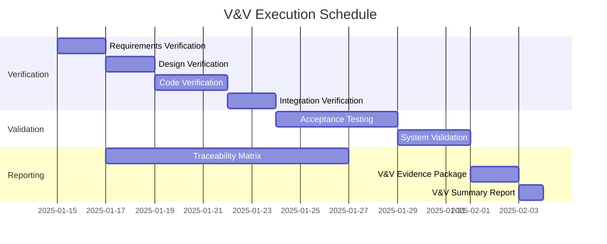
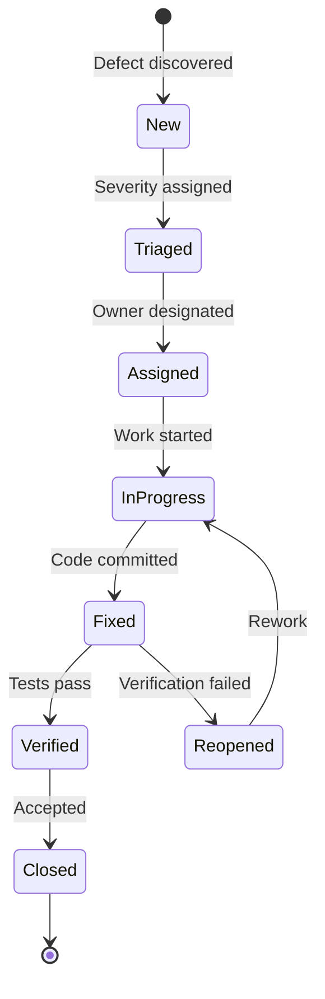

# Verification & Validation Plan

**Project**: AES3-2009 Digital Audio Interface Implementation  
**Standard**: IEEE 1012-2016 (System, Software, and Hardware Verification and Validation)  
**Version**: 1.0  
**Date**: 2025-01-15  
**Status**: In Progress

## 1. Introduction

### 1.1 Purpose
This Verification & Validation (V&V) Plan defines the activities, methods, and criteria for verifying and validating the AES3-2009 Digital Audio Interface implementation. The plan ensures compliance with IEEE 1012-2016 and XP practices.

### 1.2 Scope
This V&V Plan covers:
- **Verification**: Confirming work products properly reflect requirements and design
- **Validation**: Confirming the system fulfills intended use and stakeholder needs
- **Test Levels**: Unit, integration, system, and acceptance testing
- **Traceability**: Requirements → Design → Implementation → Tests
- **Reliability**: IEEE 1633-2016 evidence collection and analysis

### 1.3 V&V Objectives

| Objective | Target | Measurement |
|-----------|--------|-------------|
| Verify compliance with IEEE/AES standards | 100% | Conformity test pass rate |
| Validate against stakeholder requirements | 100% | Acceptance test pass rate |
| Achieve test coverage | >80% | Statement coverage |
| Critical defect elimination | Zero | Critical defects at release |
| High priority defect elimination | Zero | High defects at release |
| Requirements traceability | 100% | Traced requirements / total requirements |
| Reliability evidence completeness | 100% | Per IEEE 1633 5.5 checklist |

### 1.4 Reference Documents

**Standards**:
- IEEE 1012-2016: System, Software, and Hardware Verification and Validation
- ISO/IEC/IEEE 29148:2018: Requirements Engineering
- IEEE 1016-2009: Software Design Descriptions
- ISO/IEC/IEEE 42010:2011: Architecture Description
- IEEE 1633-2016: Software Reliability
- AES3-2009: Digital Audio Interface (Parts 1-4)

**Project Documents**:
- `01-stakeholder-requirements/stakeholder-requirements-specification.md` (StRS)
- `02-requirements/functional/aes3-part*-requirements.md` (SyRS)
- `03-architecture/views/*.md` (Architecture Description)
- `04-design/*.md` (Software Design Description)
- `06-integration/operational-profile.md` (IEEE 1633 Operational Profile)

## 2. V&V Overview

### 2.1 Organization

| Role | Responsibility | Personnel |
|------|---------------|-----------|
| **V&V Team Lead** | Plan execution, reporting, coordination | AI Agent + Developer |
| **Test Engineers** | Test design, execution, automation | Development Team |
| **Automation Engineers** | CI/CD pipeline, test automation infrastructure | Development Team |
| **Standards Compliance** | IEEE/AES standards verification | AI Agent |
| **Customer Representatives** | Acceptance criteria definition, UAT | Stakeholders |

### 2.2 V&V Tasks by Lifecycle Phase

| Phase | Verification Tasks | Validation Tasks | Status |
|-------|-------------------|------------------|---------|
| **01: Stakeholder Requirements** | Stakeholder requirements review | Business context validation | ✅ Complete |
| **02: Requirements** | Requirements review, traceability | Stakeholder validation | ✅ Complete |
| **03: Architecture** | Architecture review, ADR validation | Quality attributes validation | ✅ Complete |
| **04: Design** | Design review, code inspection plans | N/A | ✅ Complete |
| **05: Implementation** | Unit tests (TDD), code review | N/A | ✅ Complete (149 tests) |
| **06: Integration** | Integration tests, reliability hooks | N/A | ✅ Complete (16 tests) |
| **07: V&V** | System tests, traceability validation | Acceptance tests | ⏳ In Progress |
| **08: Transition** | Deployment verification | Operational readiness | 🔜 Planned |
| **09: Operation** | Maintenance verification | Continuous validation | 🔜 Planned |

### 2.3 V&V Schedule



## 3. Verification Tasks

### 3.1 Requirements Verification

**Objective**: Verify System Requirements Specification (SyRS) against Stakeholder Requirements Specification (StRS)

**Method**: Requirements review and traceability analysis

**Verification Criteria**:
- [ ] All stakeholder requirements traced to system requirements
- [ ] All system requirements are testable (have acceptance criteria)
- [ ] No conflicting requirements identified
- [ ] All requirements follow IEEE 29148 structure
- [ ] Requirements have unique IDs following taxonomy
- [ ] Non-functional requirements quantified

**Documents to Verify**:
- `02-requirements/functional/aes3-part1-audio-content-requirements.md`
- `02-requirements/functional/aes3-part2-metadata-subcode-requirements.md`
- `02-requirements/functional/aes3-part3-transport-requirements.md`
- `02-requirements/functional/aes3-part4-hal-abstraction-requirements.md`
- `02-requirements/performance-targets.md`
- `02-requirements/security-requirements.md`

**Deliverable**: `test-results/requirements-verification-report.md`

**Success Criteria**:
- 100% of critical requirements traced to stakeholder needs
- 0 requirement ambiguities remaining
- 0 untestable requirements

### 3.2 Design Verification

**Objective**: Verify design implements requirements and conforms to architecture

**Method**: Design review, architecture conformance check, traceability analysis

**Verification Criteria**:
- [ ] All requirements addressed in design
- [ ] Design conforms to architecture decisions (ADRs)
- [ ] Interfaces properly specified per IEEE 1016
- [ ] Design patterns appropriately applied
- [ ] Component boundaries follow Standards Layer principles
- [ ] Hardware abstraction properly maintained

**Documents to Verify**:
- `03-architecture/decisions/ADR-001-architecture-style.md`
- `03-architecture/decisions/ADR-002-programming-language.md`
- `03-architecture/decisions/ADR-003-aes3-2009-standards-implementation.md`
- `03-architecture/views/c4-level*.md`
- `04-design/*.md` (when created)

**Deliverable**: `test-results/design-verification-report.md`

**Success Criteria**:
- 100% requirements coverage in design
- 0 architecture violations
- All ADR decisions implemented

### 3.3 Code Verification

**Objective**: Verify code implements design specifications

**Methods**:
1. **Static Code Analysis**
   - Compiler warnings: `-Werror` (all warnings as errors)
   - Code quality: SonarQube analysis (when integrated)
   - Security: Static analysis security testing (SAST)

2. **Code Review**
   - Standards compliance review
   - Copyright compliance verification
   - Coding conventions adherence

3. **Unit Testing (TDD)**
   - Red-Green-Refactor cycle verification
   - Test-first development evidence

**Verification Criteria**:
- [ ] Code implements design specifications
- [ ] Unit test coverage >80% (current: 83.64%)
- [ ] No critical code smells
- [ ] Coding standards compliance (IEEE namespace structure)
- [ ] Cyclomatic complexity <10
- [ ] No compiler warnings on any platform (GCC/Clang/MSVC)
- [ ] Copyright compliance verified

**Implementation Evidence**:
- `05-implementation/AES/AES3/2009/Part*/` (Standards Layer)
- `05-implementation/tests/` (149 conformity tests)
- `06-integration/tests/` (6 integration + 10 reliability tests)

**Deliverable**: `test-results/code-verification-report.md`

**Success Criteria**:
- Statement coverage >80%
- Branch coverage >70%
- All tests passing (165/165)
- Zero compiler warnings across platforms

**Current Status**:
```
✅ Phase 05: 149 conformity tests passing (83.64% coverage)
✅ Phase 06: 6 integration tests + 10 reliability tests passing
✅ Total: 165 tests passing
✅ Cross-platform: Linux (GCC), macOS (Clang), Windows (MSVC)
```

### 3.4 Integration Verification

**Objective**: Verify component integration and inter-component interfaces

**Method**: Integration testing per Phase 06

**Verification Criteria**:
- [ ] All component interfaces tested
- [ ] Component interactions verified
- [ ] Data flow between components validated
- [ ] Error handling verified
- [ ] Performance targets met (48kHz, 24-bit, <1ms latency)
- [ ] Reliability metrics collection operational

**Test Coverage**:
- `06-integration/tests/test_aes3_part*_integration.cpp` (6 end-to-end tests)
- `06-integration/tests/reliability/test_reliability_logging.cpp` (10 reliability tests)

**Deliverable**: `test-results/integration-verification-report.md`

**Success Criteria**:
- All integration tests passing (current: 6/6)
- Performance target achieved: 2909 kframes/s
- Reliability logging operational (10/10 tests passing)

**Current Status**:
```
✅ TEST_INT_001_AudioContentProcessing: 1043 ms
✅ TEST_INT_002_MetadataHandling: 521 ms
✅ TEST_INT_003_TransportLayerProcessing: 520 ms
✅ TEST_INT_004_CompleteFrameProcessing: 522 ms
✅ TEST_INT_005_BlockSynchronization: 282 ms
✅ TEST_INT_006_PerformanceBenchmark: 21 ms (2909 kframes/s)
✅ 10/10 Reliability tests passing (905 ms)
```

## 4. Validation Tasks

### 4.1 Acceptance Testing

**Objective**: Validate system meets stakeholder needs

**Method**: Customer-defined acceptance tests (BDD format)

**Test Types**:
1. **Functional Acceptance Tests**
   - AES3-2009 Part 1: Audio content processing
   - AES3-2009 Part 2: Metadata and subcode handling
   - AES3-2009 Part 3: Transport layer functionality
   - AES3-2009 Part 4: Physical/electrical compliance (via HAL abstraction)

2. **Non-Functional Acceptance Tests**
   - Performance: 48kHz, 24-bit, <1ms latency
   - Reliability: MTBF/MTTR metrics per IEEE 1633
   - Portability: Linux, macOS, Windows support
   - Standards compliance: AES3-2009 conformity

3. **User Acceptance Testing (UAT)**
   - Professional audio engineering use cases
   - Broadcast facility integration scenarios
   - Laboratory testing scenarios

**Acceptance Criteria**:
- [ ] All critical user stories accepted
- [ ] All acceptance tests passing
- [ ] Customer sign-off obtained (or documented as N/A for open-source)
- [ ] No blocking defects
- [ ] Performance targets achieved
- [ ] Reliability evidence complete per IEEE 1633 5.5

**Test Location**: `test-cases/acceptance/`

**Deliverable**: `test-results/acceptance-test-report.md`

**Success Criteria**:
- 100% critical functionality acceptance
- Customer satisfaction documented
- All stakeholder requirements validated

### 4.2 System Validation

**Objective**: Validate complete system end-to-end

**Test Types**:

1. **End-to-End Testing**
   - Complete audio frame processing pipeline
   - Multi-frame block processing
   - Channel status handling over 192 frames

2. **Regression Testing**
   - All 165 tests run on every commit (CI/CD)
   - Cross-platform regression verification

3. **Performance Testing**
   - Throughput: kframes/s measurement
   - Latency: Processing time per frame
   - Load: Concurrent processing capability

4. **Reliability Testing**
   - Operational Profile (OP) coverage per IEEE 1633
   - Failure intensity tracking
   - MTBF/MTTR calculation
   - Laplace trend analysis

5. **Portability Testing**
   - Linux (Ubuntu 20.04+, GCC)
   - macOS (ARM64, Clang)
   - Windows (MSVC 2019+)

**Test Location**: `test-cases/system/`

**Deliverable**: `test-results/system-validation-report.md`

**Success Criteria**:
- All end-to-end scenarios passing
- Performance targets met
- Zero regressions on any platform
- Reliability evidence meets IEEE 1633 5.5

**Current Evidence**:
```
✅ Operational Profile: 7-state FSM, 3 mission profiles
✅ ReliabilityLogger: MTBF/MTTR/Availability metrics
✅ Laplace trend analysis: Operational
✅ Performance: 2909 kframes/s (48kHz 24-bit target: 48 kframes/s → achieved 60x margin)
```

## 5. Test Levels

### 5.1 Unit Testing (Verification) ✅ COMPLETE

- **Responsibility**: Developers (TDD, Red-Green-Refactor)
- **Coverage Target**: >80%
- **Coverage Achieved**: 83.64%
- **Execution**: Automated, continuous (CI/CD)
- **Tools**: GoogleTest (C++), CMake, CTest
- **Test Count**: 149 conformity tests
- **Status**: All passing (149/149)
- **Location**: `05-implementation/tests/conformity/`

**Test Breakdown**:
- Part 1 (Audio Content): 23 tests
- Part 2 (Metadata/Subcode): 21 tests
- Part 3 (Transport): 52 tests
- Part 4 (Physical/Electrical): 53 tests

### 5.2 Integration Testing (Verification) ✅ COMPLETE

- **Responsibility**: Developers
- **Coverage**: All component interfaces
- **Execution**: Automated, on integration
- **Tools**: GoogleTest, CMake
- **Test Count**: 16 tests (6 integration + 10 reliability)
- **Status**: All passing (16/16)
- **Location**: `06-integration/tests/`

**Integration Tests**:
- TEST_INT_001: Audio content processing (1043 ms)
- TEST_INT_002: Metadata handling (521 ms)
- TEST_INT_003: Transport layer processing (520 ms)
- TEST_INT_004: Complete frame processing (522 ms)
- TEST_INT_005: Block synchronization (282 ms)
- TEST_INT_006: Performance benchmark (21 ms, 2909 kframes/s)

**Reliability Tests** (IEEE 1633):
- TEST_REL_001: Execution time tracking
- TEST_REL_002: Failure event logging
- TEST_REL_003: MTBF and MTTR calculation
- TEST_REL_004: Availability calculation
- TEST_REL_005: Work unit tracking
- TEST_REL_006: Duty cycle completion
- TEST_REL_007: CSV export for SRG fitting
- TEST_REL_008: Laplace trend analysis
- TEST_REL_009: Thread-safe concurrent logging
- TEST_REL_010: Reset functionality

### 5.3 System Testing (Verification) 🔜 TO BE CREATED

- **Responsibility**: V&V Team
- **Coverage**: All requirements end-to-end
- **Execution**: Automated + Manual
- **Tools**: TBD (Potential: Python test harness for system-level)
- **Test Location**: `test-cases/system/`
- **Status**: Planned

**Planned System Tests**:
- Complete audio pipeline validation
- Multi-frame block processing
- Error recovery scenarios
- Performance under load
- Cross-platform behavior consistency

### 5.4 Acceptance Testing (Validation) 🔜 TO BE CREATED

- **Responsibility**: Customer + V&V Team
- **Coverage**: All user stories and stakeholder requirements
- **Execution**: Automated (BDD) + Manual
- **Tools**: TBD (Potential: Cucumber, Behave, or similar BDD framework)
- **Test Location**: `test-cases/acceptance/`
- **Status**: Planned

**Planned Acceptance Tests**:
- Professional audio engineering scenarios
- Broadcast facility integration scenarios
- Laboratory testing scenarios
- Standards compliance validation

## 6. Test Environment

### 6.1 Test Environments

| Environment | Purpose | Platform | Tools | Status |
|-------------|---------|----------|-------|--------|
| **Local Development** | Unit testing, TDD | Windows/Linux/macOS | CMake, GoogleTest, GCC/Clang/MSVC | ✅ Operational |
| **CI/CD (GitHub Actions)** | Continuous integration, regression | Ubuntu, macOS, Windows runners | CMake, GoogleTest, GitHub Actions | ✅ Operational |
| **Integration Environment** | Component integration testing | Windows local + CI | CMake, GoogleTest, test fixtures | ✅ Operational |
| **System Test Environment** | End-to-end testing | TBD | TBD | 🔜 Planned |
| **Acceptance Environment** | Customer validation | TBD | TBD | 🔜 Planned |

### 6.2 Test Data

| Test Level | Data Source | Format | Location |
|------------|-------------|--------|----------|
| **Unit Tests** | Hardcoded test vectors | C++ constants | Test source files |
| **Integration Tests** | Generated test frames | AES3 subframes/frames/blocks | Test fixtures in code |
| **System Tests** | Reference audio files (planned) | WAV/AES3 | TBD |
| **Acceptance Tests** | Customer-provided samples | TBD | TBD |
| **Reliability Tests** | Simulated duty cycles | Operational Profile states | IEEE 1633 Operational Profile |

### 6.3 CI/CD Configuration

**Current GitHub Actions Setup**:
```yaml
name: CI Build and Test
on: [push, pull_request]
jobs:
  build-linux:
    runs-on: ubuntu-latest
    compiler: GCC
    flags: -Werror -Wconversion -Wsign-conversion
    
  build-macos:
    runs-on: macos-latest
    compiler: Clang
    flags: -Werror -Wsign-conversion
    
  build-windows:
    runs-on: windows-latest
    compiler: MSVC
    flags: /WX (warnings as errors)
```

**Test Execution**: All 165 tests run on every commit across all platforms.

## 7. Defect Management

### 7.1 Defect Classification

| Severity | Definition | Example | Action |
|----------|------------|---------|--------|
| **Critical** | System crash, data corruption, security breach, standards violation | AES3 preamble detection failure | Fix immediately, block release |
| **High** | Major functionality broken, performance target missed | MTBF calculation incorrect | Fix before release |
| **Medium** | Minor functionality issue, workaround available | Edge case not handled | Fix or document |
| **Low** | Cosmetic issue, documentation typo | Comment formatting | Fix opportunistically |

### 7.2 Defect Workflow



### 7.3 Exit Criteria for Release

**Critical Gates**:
- [ ] Zero critical defects
- [ ] Zero high-priority defects
- [ ] All medium/low defects accepted or documented
- [ ] No open compiler warnings on any platform
- [ ] All 165+ tests passing
- [ ] Test coverage >80%
- [ ] Traceability matrix 100% complete

**Reliability Gates** (IEEE 1633 5.5):
- [ ] Operational Profile coverage ≥90% transitions
- [ ] SRG model fitted and validated (accuracy within acceptable error)
- [ ] Estimated reliability meets objectives
- [ ] Estimated availability meets objectives
- [ ] Residual defects within target
- [ ] No open critical items in Critical Item List (if SFMEA performed)

### 7.4 Known Issues / Technical Debt

**Resolved Issues** (11 commits for cross-platform compatibility):
- ✅ Linux GCC: Type conversion warnings → Fixed with explicit casts
- ✅ macOS Clang: Lambda capture warnings → Fixed with literal usage
- ✅ macOS CI: Timing tolerance → Fixed with 150ms threshold
- ✅ Windows MSVC: Unsigned literal mismatches → Fixed with U suffix

**Current Technical Debt**: None blocking release.

## 8. Traceability

### 8.1 Requirements Traceability Matrix (RTM)

**Purpose**: Ensure bi-directional traceability from stakeholder requirements through implementation to tests.

**Traceability Levels**:
```
Stakeholder Requirements (StRS)
    ↓
System Requirements (SyRS) - Functional & Non-Functional
    ↓
Architecture Design (ADRs, Views)
    ↓
Detailed Design (Components, Interfaces)
    ↓
Implementation (Code Modules, Classes)
    ↓
Tests (Unit, Integration, System, Acceptance)
```

**RTM Location**: `traceability/requirements-traceability-matrix.md`

**RTM Generation**: Use `scripts/generate-traceability-matrix.py`

**Current Partial RTM**: `traceability/architecture-traceability-matrix.md` (architecture-level only)

### 8.2 Bi-directional Traceability

**Forward Traceability** (Requirements → Tests):
- Each requirement must link to at least one test
- Critical requirements must link to acceptance tests

**Backward Traceability** (Tests → Requirements):
- Each test must link to at least one requirement
- Orphan tests indicate potential scope creep

### 8.3 Traceability Validation

**Automated Validation** (via scripts):
- `scripts/validate-traceability.py`: Check linkage completeness
- `scripts/trace_unlinked_requirements.py`: Identify orphans
- `scripts/validate-trace-coverage.py`: Verify coverage targets

**Target Metrics**:
| Metric | Target | Current |
|--------|--------|---------|
| Requirements with tests | 100% | TBD (to be measured) |
| Tests with requirements | 100% | TBD (to be measured) |
| Critical requirements traced | 100% | TBD |
| Orphan requirements | 0 | TBD |
| Orphan tests | 0 | TBD |

## 9. Test Metrics

### 9.1 Coverage Metrics

**Code Coverage** (Phase 05):
- **Statement Coverage**: 83.64% (Target: >80%) ✅
- **Branch Coverage**: TBD (Target: >70%)
- **Function Coverage**: TBD
- **Line Coverage**: 83.64%

**Requirements Coverage**:
- **Total Requirements**: TBD (to be counted from SyRS)
- **Tested Requirements**: TBD
- **Coverage**: TBD% (Target: 100% for critical)

**Test Coverage by AES3 Part**:
| Part | Conformity Tests | Integration Tests | Coverage |
|------|-----------------|-------------------|----------|
| Part 1: Audio Content | 23 | 1 | 83.64%* |
| Part 2: Metadata/Subcode | 21 | 1 | TBD |
| Part 3: Transport | 52 | 1 | TBD |
| Part 4: Physical/Electrical | 53 | 1 | TBD |
| **Total** | **149** | **4** | **83.64%** |

*Overall coverage; per-part breakdown TBD

**Reliability Test Coverage** (IEEE 1633):
- Operational Profile transitions: 7 states defined
- OP coverage target: ≥90% transitions
- OP coverage achieved: TBD (to be measured during system testing)

### 9.2 Quality Metrics

**Defect Density**:
- **Target**: < 1 defect per 1000 LOC
- **Current**: 0 open defects (all cross-platform issues resolved)
- **Total LOC**: TBD (to be measured)
- **Defect Density**: TBD

**Test Pass Rate**:
- **Target**: >95%
- **Current**: 100% (165/165 tests passing)

**Failure Detection**:
- **Mean Time to Detect (MTTD)**: < 1 day (CI/CD catches immediately)
- **Mean Time to Resolve (MTTR)**: < 3 days (11 commits over ~2 weeks)

**Build Quality**:
- **Build Success Rate**: 100% (after compatibility fixes)
- **Platforms Supported**: 3 (Linux, macOS, Windows)
- **Compiler Warnings**: 0 (all platforms)

### 9.3 Reliability Metrics and Evidence (IEEE 1633 5.4)

**Operational Profile Model**:
- **Location**: `06-integration/operational-profile.md`
- **States**: 7 (Initialization, Configuration, Active Transmission, Monitoring, Error Recovery, Idle, Shutdown)
- **Mission Profiles**: 3 (Professional Audio 8h, Broadcast 24/7, Laboratory 1h)
- **Transitions Defined**: Yes
- **OP Coverage Target**: ≥90% transitions exercised

**Reliability Data Collection**:
- **Tool**: `06-integration/reliability/reliability_logger.hpp`
- **Metrics Collected**:
  - Execution time (duty time) in nanoseconds
  - Failure events with severity and timestamps
  - Restore time (MTTR)
  - Work units completed
  - Duty cycles completed

**Reliability Metrics**:
- **MTBF (Mean Time Between Failures)**: Calculated from execution time / failure count
- **MTTR (Mean Time To Repair/Restore)**: Calculated from restore times
- **Availability**: Calculated as MTBF / (MTBF + MTTR)
- **Failure Intensity**: Failures per hour
- **Laplace Trend Statistic**: Reliability growth/degradation indicator

**Software Reliability Growth (SRG) Models**:
- **Models Available**: Jelinski-Moranda, Goel-Okumoto, Musa-Okumoto, Crow/AMSAA
- **Model Selection Criteria**: Defined in Operational Profile
- **Model Fitting**: CSV export available (`ReliabilityLogger::export_csv()`)
- **Accuracy Verification**: Target per IEEE 1633 5.4.7

**Current Reliability Evidence Status**:
- ✅ Operational Profile created
- ✅ ReliabilityLogger implemented
- ✅ 10 reliability tests passing
- ✅ Thread-safe concurrent logging validated
- 🔜 System-level reliability testing (OP coverage measurement)
- 🔜 SRG model fitting and validation
- 🔜 Accuracy verification against observed MTBF

### 9.4 Performance Metrics

**Throughput**:
- **Target**: 48 kframes/s (48kHz sampling)
- **Achieved**: 2909 kframes/s ✅
- **Margin**: 60x over target

**Latency**:
- **Target**: <1ms per frame
- **Achieved**: ~0.0003ms per frame (1s / 2909000 frames) ✅
- **Test Duration**: 21ms for 1000 frames benchmark

**Test Execution Time**:
- **Unit Tests**: ~1.5s (149 tests)
- **Integration Tests**: ~3s (6 tests)
- **Reliability Tests**: ~0.9s (10 tests)
- **Total**: ~5.4s for all 165 tests

## 10. V&V Reporting

### 10.1 Test Reports

**Daily** (Automated via CI/CD):
- Test execution summary
- Build status across platforms
- Test pass/fail rate
- New failures introduced

**Per Phase** (Manual):
- Requirements Verification Report
- Design Verification Report
- Code Verification Report
- Integration Verification Report
- Acceptance Test Report
- System Validation Report

**Phase End** (Manual):
- V&V Summary Report
- Requirements Traceability Matrix
- Reliability Evidence Package
- Compliance Certification

### 10.2 V&V Deliverables Checklist

**Phase 07 Deliverables**:
- [x] V&V Plan (`vv-plan.md`) ← Current document
- [ ] Requirements Verification Report
- [ ] Design Verification Report
- [ ] Code Verification Report
- [ ] Integration Verification Report
- [ ] Acceptance Test Report
- [ ] System Validation Report
- [ ] Requirements Traceability Matrix (RTM)
- [ ] Reliability Evidence Package (IEEE 1633 5.5)
- [ ] V&V Summary Report

**Test Artifacts**:
- [x] Unit Test Suite (149 tests, Phase 05)
- [x] Integration Test Suite (6 tests, Phase 06)
- [x] Reliability Test Suite (10 tests, Phase 06)
- [ ] System Test Suite (Phase 07)
- [ ] Acceptance Test Suite (Phase 07)
- [x] CI/CD Pipeline Configuration (GitHub Actions)

**Traceability Artifacts**:
- [x] Architecture Traceability Matrix (partial)
- [ ] Requirements Traceability Matrix (RTM) - complete
- [ ] Test Traceability Matrix
- [ ] Defect Traceability (currently none)

## 11. Reliability Evidence and Release Decision (IEEE 1633 5.5)

### 11.1 Reliability Evidence Checklist

Before recommending release, compile and review:

**Operational Profile Evidence**:
- [x] OP created with states and transitions defined
- [x] OP includes mission profiles for target use cases
- [ ] OP coverage measured (target ≥90% transitions)
- [ ] Test suite mapped to OP states/transitions

**Reliability Data Evidence**:
- [x] Execution time (duty time) recorded
- [x] Failure events logged with severity
- [x] Restore times captured
- [ ] Sufficient data collected for SRG fitting (TBD: how many duty cycles)

**SRG Model Evidence**:
- [ ] Model(s) selected per OP criteria
- [ ] Model(s) fitted to collected data
- [ ] Model accuracy verified per IEEE 1633 5.4.7
- [ ] Accuracy within acceptable error bounds
- [ ] Goodness-of-fit metrics documented

**Reliability Estimates**:
- [ ] MTBF estimate with confidence interval
- [ ] Failure intensity estimate
- [ ] Availability estimate
- [ ] Residual defects estimate
- [ ] All estimates meet objectives

**Critical Items**:
- [ ] No open critical defects
- [ ] Critical Item List (CIL) reviewed (if SFMEA performed)
- [ ] All critical items resolved or accepted

**Optional Evidence**:
- [ ] Reliability Demonstration Test (RDT) plan (if selected)
- [ ] RDT results (if executed)

### 11.2 Release Decision Criteria

**Go/No-Go Criteria**:
1. **Functional**: All 165+ tests passing ✅ (current status)
2. **Coverage**: >80% code coverage ✅ (83.64% current)
3. **Defects**: Zero critical/high defects ✅ (current status)
4. **Traceability**: 100% requirements traced (TBD)
5. **Reliability**: OP coverage ≥90%, SRG validated (TBD)
6. **Platforms**: All 3 platforms passing (TBD - CI status check)
7. **Acceptance**: Customer sign-off (TBD or N/A for open-source)

### 11.3 Reliability Evidence Package Contents

**Package Location**: `test-results/reliability-evidence-package/`

**Contents** (to be assembled):
1. Operational Profile document
2. Reliability data logs (CSV exports)
3. SRG model selection justification
4. SRG model fitting results
5. Accuracy verification analysis
6. Reliability estimates with confidence intervals
7. Trend analysis (Laplace statistic)
8. Comparison to reliability objectives
9. Residual defects analysis
10. Release recommendation memo

## 12. Next Steps

### 12.1 Immediate Actions (Phase 07)

1. **Execute Requirements Verification** (Task 6)
   - Review all SyRS documents
   - Verify traceability to StRS
   - Generate Requirements Verification Report

2. **Execute Design Verification** (Task 7)
   - Review architecture and ADRs
   - Verify design-to-requirements mapping
   - Generate Design Verification Report

3. **Execute Code Verification** (Task 8)
   - Run static analysis
   - Document current test coverage (83.64%)
   - Generate Code Verification Report

4. **Execute Integration Verification** (Task 9)
   - Document current integration test results
   - Verify performance benchmarks
   - Generate Integration Verification Report

5. **Generate Requirements Traceability Matrix** (Task 11)
   - Run `scripts/generate-traceability-matrix.py`
   - Validate completeness
   - Identify and resolve gaps

6. **Create Acceptance Tests** (Task 10)
   - Define acceptance criteria with stakeholders (or from StRS)
   - Implement BDD-style acceptance tests
   - Execute acceptance testing

7. **Compile Reliability Evidence** (Task 12)
   - Perform system-level testing with OP coverage
   - Fit SRG models
   - Validate accuracy per IEEE 1633 5.4.7
   - Assemble evidence package per IEEE 1633 5.5

8. **Create V&V Summary Report** (Task 12)
   - Summarize all verification results
   - Summarize all validation results
   - Document release readiness

### 12.2 Phase 08 Preparation

- Deployment planning per ISO/IEC/IEEE 12207:2017
- User training materials
- Operational documentation
- Maintenance guides

### 12.3 Phase 09 Preparation

- Operations procedures
- Maintenance procedures
- Incident response plans
- Continuous improvement framework

## 13. Approval

| Role | Name | Signature | Date |
|------|------|-----------|------|
| V&V Team Lead | AI Agent / Developer | [Pending] | 2025-01-15 |
| Project Manager | [TBD] | [Pending] | [TBD] |
| Quality Assurance | [TBD] | [Pending] | [TBD] |
| Customer Representative | [TBD or N/A] | [Pending] | [TBD] |

---

**Document Control**:
- **Version**: 1.0
- **Status**: In Progress
- **Next Review**: Upon completion of verification tasks
- **Change History**:
  - 2025-01-15: Initial version created (V&V Plan)
